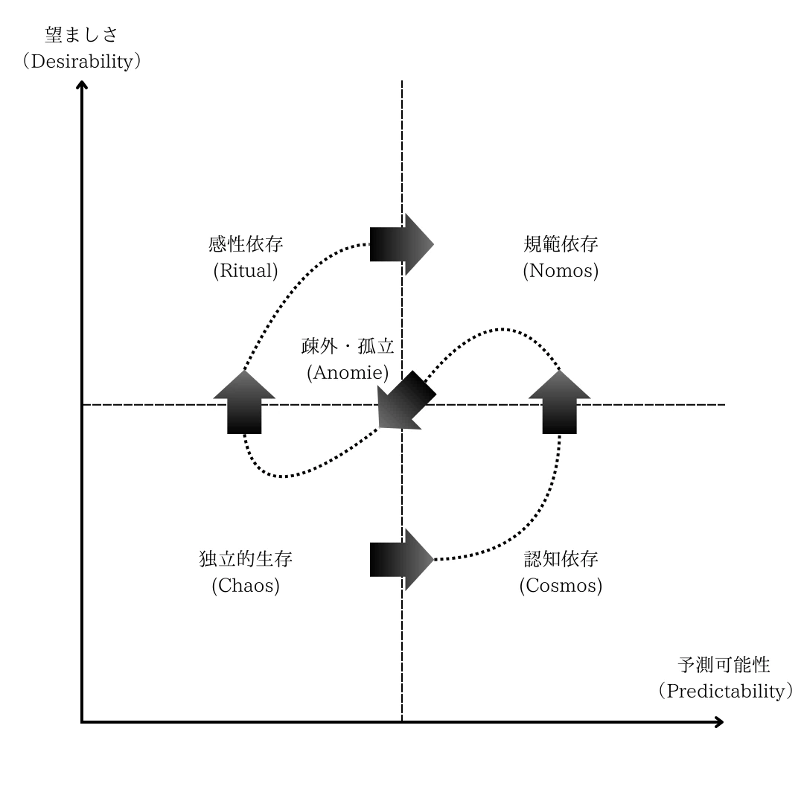

## Chapter 1: Fundamental Value Construction

- An Essay on Value Emergence Systems -

*Preface: Readers may begin this essay starting from section "1.1 Universal Forms of Truth, Goodness, and Beauty." This section constitutes the core of "Chapter 1: Fundamental Value Construction" and serves as the premise for subsequent chapters.*

*The preceding sections present the theoretical background leading up to the core of this chapter, primarily concerning the "Free Energy Principle." However, its position relative to the theory presented in this essay is strictly one of support through application. Therefore, it is possible to proceed to the discussions from section 1.1 onwards without reading the preceding parts (sections 1.01 to 1.03). Nevertheless, I believe these earlier sections may hold interest for readers concerned with fundamental inquiry.*

### 1.01 The Form of Belief

Our perception is not merely a passive process of taking in external stimuli. Perception is the working of mental images arising internally. When capturing the working of such mental images, psychology posits **constructs** (構成概念). A construct refers to a theoretical concept established for convenience to explain internal states or psychological processes that cannot be directly observed. Here, as an example of constructs, let us assume we possess beliefs that predict "reality will likely be this way" and *a priori* (先験的) beliefs about "how the world ought to be."

We feel surprise when reality unfolds differently from the predictions based on our beliefs. From the perspective of the meaning (value) of perception, reality is better the more it aligns with expectations. Therefore, we constantly update our beliefs, adjusting them to reduce the difference between reality and prediction. We position this as the acquisition of *a posteriori* (経験的) beliefs.

The term "**belief**" (信念) here is based on one of the two major currents in the philosophical interpretation of probability theory: the stance that "understands probability as the degree of belief about an object." First, let's formalize the belief predicting "reality will likely be this way" probabilistically.

Specifically, the degree of belief about how likely event $o$ is to occur is represented by the probability $p(o)$. Then, the magnitude of **surprise** (驚き) upon the occurrence of event $o$ is formally represented by a continuous function $f(p(o))$. This means the magnitude of surprise $f(\cdot)$ depends on the belief (probability) $p(o)$. The continuity of the function implies that a change in the probability value causing a minute change in surprise converges to a limited difference. Surprise $f(p(o))$ is empirically considered to satisfy the following properties:

* There is no surprise upon the occurrence of an event $o$ that one is certain will happen. That is, $f(p(o)) = f(1) = 0$.
* There is surprise upon the occurrence of an event $o$ that one believes, to some extent, will not happen. That is, surprise takes a positive value in the range $[0, 1)$ of probability $p$.
* In a somewhat special case, suppose there is a communication reporting the occurrence of event $O \supset o$ which includes the occurrence of event $o$, followed by a communication reporting the occurrence of event $o$. The sum of the final surprise is equal to the surprise of perceiving the occurrence of event $o$ at once. That is, $f(p(o)) = f(p(O)) + f(p(o)/p(O))$ holds. This implies that the law of addition $f(xy) = f(x) + f(y)$ holds for surprise $f$.

Solving the differential equation for $f(x)$ derived assuming these properties yields the solution $f(x) = c \ln x + d, \text{ where } c < 0$. From this, surprise is generally defined as follows:

**Definition of Surprise (Shannon's surprise)**

The surprise when an event with probability $p$ occurs is defined as

$$
-\ln p, \quad (0 < p \le 1)
$$

Thus, by formalizing beliefs as probabilities, surprise is derived as negative logarithmic probability. Then, the fact that events with a lower degree of belief in their occurrence (i.e., lower probability) result in greater surprise when they occur is naturally shown by the monotonically decreasing nature of the negative logarithmic function.

With the formulation of surprise, the value norm "reality is better the more it meets expectations" is also expressed as "**surprise minimization**." As mentioned earlier, we assumed that surprise minimization is positioned as the process of updating *a priori* beliefs and acquiring empirical beliefs.

Therefore, let's formalize the *a priori* belief about "how the world ought to be." Specifically, represent the degree of belief that a latent (unknowable) state of the world $x$ holds with probability $p(x)$, and how likely event $o$ is to occur under that state $x$ (likelihood) with conditional probability $p(o \mid x)$. In this case, the previously defined probability $p(o)$ is obtained by **marginalization** as follows:

$$
p(o) = \int p(x) p(o \mid x) dx
$$

By introducing an arbitrary function (probability distribution) $q(x)$ and using **Jensen's inequality**, we can evaluate the upper bound of surprise $-\ln p(o)$. The following is a typical derivation process:

$$
-\ln p(o) = -\ln \int p(x) p(o \mid x) dx = -\ln \int q(x) \frac{p(x) p(o \mid x)}{q(x)} dx
$$

Here, since $-\ln$ is a convex function, applying Jensen's inequality gives:

$$
-\ln p(o) \le \int q(x) \left[ -\ln \frac{p(x) p(o \mid x)}{q(x)} \right] dx = \int q(x) [\ln q(x) - \ln p(x, o)] dx
$$

And defining the right-hand side of the above equation as the functional

$$
F[q, o] := \mathbb{E}_{q(x)} [\ln q(x) - \ln p(x, o)]
$$

yields

$$
-\ln p(o) \le F[q, o]
$$

That is, surprise (Shannon's surprise) $-\ln p(o)$ becomes the lower bound of the functional $F[q, o]$ (or $F$ is the upper bound of surprise). The derived functional $F$ is known as "**Free Energy**," and surprise minimization reduces to the problem of finding the function $q(x)$ that minimizes free energy. Such a problem, minimizing the value of functional $F$ with function $q$ as the variable, is called a "**variational problem**."

Furthermore, the free energy $F[q, o]$ can be transformed as follows:

$$
F[q, o] = \mathbb{E}_{q(x)} [\ln q(x) - \ln p(x \mid o)] \underbrace{-\ln p(o)}_{\text{Shannon's surprise}}
$$

Here, using **Bayes' theorem**

$$
p(x \mid o) = \frac{p(x) p(o \mid x)}{p(o)}
$$

where $p(o)$ is the marginal likelihood mentioned before. From the above equation, it can be seen that the difference between $F[q, o]$ and surprise $-\ln p(o)$ is the **KL divergence** (Kullback–Leibler divergence), known as a measure of the difference between two probability distributions.

$$
D_{\mathrm{KL}}[q(x) \mid\mid p(x \mid o)] = \mathbb{E}_{q(x)} [\ln q(x) - \ln p(x \mid o)]
$$

Therefore, free energy minimization is equivalent to the problem of finding $q(x)$ that minimizes $D_{\mathrm{KL}}[q(x) \mid\mid p(x \mid o)]$, i.e., approximating the empirical belief probability $p(x \mid o)$ in **Bayesian inference**.

Also, the free energy $F[q, o]$ can be transformed into the following two equations:
$$
F[q, o] = \underbrace{-\mathbb{E}_{q(x)}[\ln p(o, x)]}_{\text{energy}} - \underbrace{\mathbb{E}_{q(x)}[-\ln q(x)]}_{\text{Shannon's entropy}}
$$
$$
F[q, o] = \underbrace{\mathbb{E}_{q(x)}[\ln q(x) - \ln p(x)]}_{\text{complexity}} - \underbrace{\mathbb{E}_{q(x)}[\ln p(o \mid x)]}_{\text{accuracy}}
$$

The first equation provides a perspective for interpreting free energy by decomposing it into "**energy**" and "**Shannon's entropy**" terms. Here, the "energy" term is (the negative of) the expected value of the logarithm of the joint probability $p(o, x)$ of the world's latent state $x$ and event $o$ under belief $q(x)$, and can be regarded as a measure of "how likely the system is to adopt high-likelihood states." Lower energy means event $o$ is more likely to occur under the states assumed by belief $q(x)$.

On the other hand, the "entropy" term is an indicator of how broadly the system considers the potential states it could adopt. Higher entropy means the belief $q$ is not biased towards specific states but acknowledges diverse possibilities, making it a more "tolerant" belief. Let's touch upon the **maximum entropy principle** here. This principle asserts that "among distributions satisfying given constraints, the distribution with maximum entropy is the one with the least bias (adding no unnecessary assumptions)." The inclusion of the entropy term (with its sign reversed) in free energy minimization suggests a natural consistency with the idea of the maximum entropy principle, which attempts to explain observations while avoiding bias and maintaining entropy as high as possible.

Next, the second equation interprets free energy from the two perspectives of "**complexity**" and "**accuracy**." Here, the "complexity" term corresponds to the KL divergence $D_{\mathrm{KL}}[q(x) \mid\mid p(x)]$, indicating how much the approximate distribution $q(x)$ deviates from the prior distribution $p(x)$. In other words, adopting empirical beliefs that deviate significantly from *a priori* beliefs increases "complexity" accordingly.

On the other hand, the "accuracy" term is the expected value of the likelihood (log-likelihood) indicating how well observation $o$ can be explained under belief $q(x)$, representing the demand to increase consistency with observed data. That is, free energy minimization is also related to the "**bias-variance tradeoff**" in statistical learning theory. In other words, it indicates an adaptive demand to acquire empirical beliefs that balance the highest degree of generalization with the maximum adaptation to specific events.

From the above, it can be seen that our perceptual process can be formally described as "**variational free energy minimization**," an approximation of Bayesian inference, based on the value norm of surprise minimization. This formalizes the series of mental processes where we hold probabilistic beliefs (predictions) about "how reality will likely be," feel surprise when those predictions are overturned by external experiences (phenomena), and update our beliefs in the direction that reduces that surprise. This framework is the theory called the **Free Energy Principle (FEP)**, proposed by Karl Friston.

### 1.02 Self-Evidencing

On the other hand, to clarify the substance of our belief systems, we must turn our attention not only to the realm of perception but also to the dimension of "**action**" (行動). We do not merely passively perceive the external world and reduce surprise each time. Using predictive mental images that imagine the future, we actively generate our own actions. And the process of action, too, can be understood from the value norm of surprise minimization.

For example, in a certain situation, we hold the prediction that "taking this action will yield a desirable result (or avoid an undesirable one)." And when a discrepancy arises between the prediction and the actual result, we update our beliefs to minimize that surprise. Thus, action, like perception, can also be regarded as a process related to the value norm of "surprise minimization."

From this perspective, an approach introducing the construct "**Expected Free Energy**" (期待自由エネルギー) — the expected value of future free energy — has been considered. Just as the perceptual process was described as variational free energy minimization, this is an attempt to describe the action process as "expected free energy minimization."

First, considering the action $a$ the agent will take in the future, we posit a condition "dependent on the future action $a$" (denoted by $\mid a$) in the free energy $F$ equation. Then, expected free energy $G$ is defined in a form that takes the expectation over the joint probability $q(o, x \mid a)$ — the agent's approximate empirical belief about the future, encompassing potential future events $o$ and their underlying latent states $x$.

$$
G(a) := \mathbb{E}_{q(o, x \mid a)} \left[ \ln q(x \mid a) - \ln p(x, o \mid a) \right] 
$$

When dealing with the above equation $G(a)$, the decomposition $q(o, x \mid a) = p(o \mid a) q(x \mid a)$ is often assumed. This means that empirical beliefs about future events can be expressed based on empirical beliefs about latent states $x$. In this case, the expectation operator $\mathbb{E}_{q(o, x \mid a)}[\cdot]$ can be treated as a two-stage expectation $\mathbb{E}_{p(o \mid a)} \mathbb{E}_{q(x \mid a)}$.

Furthermore, $p(x, o \mid a)$ is also often decomposed, for instance as $p(x, o \mid a) = p(x \mid o, a) \tilde{p}(o)$, where $\tilde{p}(o)$ is interpreted as an "*a priori* **preference**" (選好) anticipating high probability for desirable events $o$. "Preference" is a construct referring to the tastes an decision-making agent holds towards options.

Based on these decompositions, expected free energy $G(a)$ can be transformed as follows:

$$
G(a) = -\underbrace{\mathbb{E}_{p(o \mid a)} \mathbb{E}_{q(x \mid a)} \left[ \ln \frac{q(x \mid o, a)}{q(x \mid a)} \right]}_{\text{epistemic value}} - \underbrace{\mathbb{E}_{p(o \mid a)} \left[ \ln \tilde{p}(o) \right]}_{\text{pragmatic value}}
$$

The first term is called "**epistemic value**." This is the amount obtained by taking the weighted average (expectation) with respect to the occurrence probability $q(o \mid a)$ of event $o$, over the KL divergence

$$
D_{\mathrm{KL}}[q(x \mid o, a) \mid\mid q(x \mid a)] = \mathbb{E}_{q(x \mid a)} \left[ \ln \frac{q(x \mid o, a)}{q(x \mid a)} \right]
$$

which represents how much beliefs about the latent state $x$ are updated by the future event $o$. That is, in the minimization of $G(a)$, it can be interpreted as representing an epistemic/exploratory principle of action, where actions $a$ anticipating events $o$ that yield "much information" (= large KL divergence) are chosen.

The second term is called "**pragmatic value**." When $\tilde{p}(o)$ is given as a preference, it is an amount that increases the more desirable events are anticipated. Therefore, in the minimization of $G(a)$, it can be interpreted as representing a pragmatic principle of action, where actions $a$ realizing desirable events $o$ are chosen.

Alternatively, if $\tilde{p}(o)$ is not interpreted as preference, simply setting $\tilde{p}(o) = p(o \mid a)$ makes the second term take the form of entropy representing uncertainty. In this case, the minimization of $G(a)$ can be interpreted as incorporating a principle of action that minimizes anticipated future uncertainty.

Thus, by introducing the concept of expected free energy, perception and action can be described in a consistent format under the value norm of "surprise minimization." Also, two values (meanings) in action became clear: the epistemic value of seeking more information to reduce future uncertainty, and the pragmatic value leading towards a desirable (or low-uncertainty) future. This formulation is a framework considered as an extension of the free energy principle, called **Active Inference** (能動的推論).

In the philosophy of Active Inference, such a cycle of perception and action is regarded as essentially "**self-evidencing**" (自己証明). Self-evidencing refers to the process of constantly proving one's own existence. That is, because it is inherently impossible for life to depict in its mental imagery the reality of "itself not being alive," survival is sustained as a result of repeating the least surprising event: the "reality of being alive."

In summary, it has been shown that the belief system itself—"that we possess a belief system in the first place"—can be formulated through frameworks like surprise minimization, variational free energy minimization, and expected free energy minimization. That is, the cycle of perception and action, based on the value norm of "reducing surprise," can be uniformly depicted as a "self-evidencing process" that approximates Bayesian inference.

Here, the initial objective of conceptually elucidating the substance of the belief system "that we possess belief systems" can be considered achieved for the time being.

### 1.03 The Dynamics of Belief

> 6.3211 Indeed people knew beforehand that there must be *a* law of least action, before they knew exactly how it ran. (Here, as always, the *a priori* certain proves to be something purely logical.)
> Wittgenstein, *Tractatus Logico-Philosophicus*

Up to this point, following the practice of positing constructs to formally describe our mental processes, we have outlined the free energy principle as "psychology." However, investigating how this principle connects with actual physical ontology, beyond being just a model metaphor, is essential for a more fundamental understanding. Therefore, this section re-examines the same free energy principle, this time from the perspective of "physics," aiming to clarify the "**dynamics**" (力学) of how our belief systems are generated and maintained.

Dynamics is nothing less than an attempt to axiomatically construct our belief system regarding the empirical world according to a single plan. That is, from here on, the subject of consideration becomes the dynamics underlying the movement of beliefs, and the *a priori* intuited principle governing it.

The framework providing these "dynamics of belief" is precisely **Bayesian mechanics** (ベイズ力学). Bayesian mechanics models how physical systems, especially self-organizing entities (e.g., living organisms), behave as if they hold and update probabilistic beliefs about the environment in which they are embedded. This is not merely a metaphor; it is an attempt to fundamentally link the system's physical dynamics (material aspect) with the dynamics of the beliefs it embodies and encodes (informational aspect). The "law of belief updating" formalized in the previous section as free energy minimization can be understood, along with its generative principle, within this broader framework of Bayesian mechanics.

So, what is that generative principle? It is the "**Free Energy Principle (FEP)**" itself, which has repeatedly appeared up to the previous section. FEP is not limited to being just an algorithm for variational inference or a description of the self-evidencing process. Like the principle of least action that derives Newton's laws of motion, it is positioned as a fundamental requirement for an entity to remain an entity (= maintain a specific structure, or "identity"), i.e., as an "*a priori* **principle**." What FEP asserts is: "If something exists maintaining its structure for a certain period, it must necessarily (implicitly) embody a statistical generative model of its environment and behave so as to minimize free energy (an upper bound on surprise)." This principle is the fundamental mechanism driving the dynamics of belief updating (approximate Bayesian inference) described in the previous section.

But how can a system "have beliefs"? Bayesian mechanics and FEP hinge on the existence of a "**particular partition**" (特定の分割), a boundary structure called the **Markov Blanket** (マルコフブランケット). A Markov Blanket is a boundary interface that partitions a system into **internal states** ($\mu$), statistically separated from the **external environment** (External states: $\eta$), and **blanket states** ($b$ = sensory states $s$ + active states $a$) that mediate between them. Only with the existence of this boundary does the process where internal states $\mu$ encode information (i.e., beliefs, typically parameters of a variational density $q(\mu)$) about external states $\eta$, update those beliefs via sensory states $s$, and act on the external world via active states $a$ (perform self-evidencing) become meaningful. Recent research (**Sparse Coupling Conjecture: SCC**, 疎結合予想) strongly suggests that sufficiently large and complex systems (including living organisms) universally (or approximately) possess such a Markov Blanket structure, ensuring the generality of this framework.

Under this principle (FEP) and structure (Markov Blanket), the "dynamics of belief" concretely unfold. The dynamics of internal states (those encoding beliefs) are driven towards the direction of minimum free energy. This is depicted as a "**flow**" of beliefs moving on an abstract belief space called a "**statistical manifold**." Guiding this flow is the system's "**ontological potential**" (存在論的ポテンシャル). This is a potential defined by the state (non-equilibrium steady-state density, NESS) towards which the system must inevitably head to maintain "its identity," and its gradient becomes the force guiding beliefs in the proper direction. It has been shown that this flow can further be decomposed by the **Helmholtz decomposition** into a **dissipative** (orthogonal) flow, which corrects beliefs in response to environmental changes, and a **conservative** (parallel/solenoidal) flow, which explores possible states under the current beliefs, capturing the complex aspects of belief dynamics.

Furthermore, it has been clarified that these FEP-based dynamics of belief possess a **duality** (双対性) with the "**Constrained Maximum Entropy Principle (CMEP)**" (制約付き最大エントロピー原理). This means that the process where the system's internal states attempt to minimize free energy (FEP, internal perspective) is mathematically equivalent to the process where, from an external observer's viewpoint, the system attempts to maximize entropy (uncertainty) under the specific "**constraints**" that define its existence (CMEP, external perspective). This duality is important because it suggests that the dynamics of belief (FEP) are not merely an information processing algorithm, but are consistent with the universal physical law of entropy increase, and are rather a necessary consequence arising from the constraint of "continuing to exist" within that law. For an entity to possess beliefs is a fundamental manifestation of existence itself, striving for maximum possible freedom (entropy) within physical constraints.

In conclusion, Bayesian mechanics, by placing the Free Energy Principle (and its dual, CMEP) at its foundation, provides a principled explanation for how our belief systems are dynamically generated and maintained. The dynamics where an entity attempts to minimize surprise through a self-evidencing process are not mere psychological tendencies, but necessary dynamics rooted in physical laws, possessing a Markov Blanket structure and guided by an ontological potential (or constraints).

### 1.1 Universal Forms of Truth, Goodness, and Beauty

To summarize, the essence of life lies in maintaining and repeating the reality of its own "life." In particular, it can be said to be an existence that attempts to stably repeat a desirable environment suitable for survival with low uncertainty, i.e., an ideal reality. This ideal state can be conceptualized as a state where "**Predictable Reality**" and "**Desirable Reality**" completely coincide with "**Living Reality**." This essay defines this ideal state as "**Harmonious Reality**" (調和的現実).

However, in actual experience, this ideal harmony is not always fulfilled. This very discrepancy between ideal and reality becomes the fundamental motivation for life to pursue the values of **Truth, Goodness, and Beauty**. As shown below, each of Truth, Goodness, and Beauty can be clearly positioned as a condition for establishing "Harmonious Reality."

* **Pursuit of "Truth"** (真): Condition responsible for bringing "Living Reality" closer to "Predictable Reality" (elucidation/understanding of the unknown).
* **Pursuit of "Goodness"** (善): Condition responsible for aligning/harmonizing "Predictable Reality" and "Desirable Reality" (formation/maintenance of desirable order).
* **Pursuit of "Beauty"** (美): Condition responsible for bringing "Living Reality" closer to "Desirable Reality" (sensitivity to ideals, novelty, creativity).

The following diagram provides a more intuitive grasp of these positionings. This diagram is a Venn diagram representing the entirety of reality that life can experience. Outside the largest circle is the "**Inviable**" region, and inside is the "**Viable**" region. The "Viable" region encompasses the "**Predictable**" and "**Desirable**" regions. These two regions respectively indicate parts where predictability or desirability exceeds a certain threshold, and their overlapping part is the previously defined "**Harmonious**" region.

The three arrows in the diagram indicate the directions for expanding each region, symbolizing the effects brought about by the pursuit of "Truth," "Goodness," and "Beauty," respectively. That is, they represent the action of expanding/maintaining "Predictable Reality," "Harmonious Reality," and "Desirable Reality."

||
|:--:|
|*Figure 1: Harmonious Composition of Truth, Goodness, and Beauty*|

* The pursuit of **Truth** expands the region of "Predictable Reality."
* The pursuit of **Goodness** expands and maintains the region of "Harmonious Reality," the overlap of "Predictable Reality" and "Desirable Reality."
* The pursuit of **Beauty** expands the region of "Desirable Reality."

Thus, the pursuits of Truth, Goodness, and Beauty each function as conditions for realizing "Harmonious Reality" by overlapping the three aspects: "Predictable Reality," "Desirable Reality," and "Living Reality." Complete "Harmonious Reality" is not always achieved. Rather, it is precisely because of its imperfection or discrepancy that life gains the fundamental impetus to explore the unknown (Truth), depict ideals and sense new possibilities (Beauty), and strive to change reality for the better (Goodness).

Truth, Goodness, and Beauty act from different aspects depending on the situation life is placed in, but ultimately form complementary "**forces**" directed towards the common goal of "Harmonious Reality." This complementary integration of the three values centered on life is grasped as the **universal form of value** observed across ages and cultures, continuing to be repeated even now as the foundation of all values.

### 1.2 Generation and Repetition of Structure

On the other hand, the **plurality** (多元性) of values is inevitable, given that belief systems are unique to each life form. The interaction between different subjects can be understood as a process aiming ultimately for "**Mutual Harmony**" (相互調和), repeating conflicts and cooperation between different values.

Mutual Harmony refers to a state where the respective "Harmonious Realities" of multiple subjects are established within an interdependent relationship. In other words, it is a complementary state where the perception or action of one subject becomes a condition for the Harmonious Reality of others, and simultaneously, the perception or action of others becomes a condition for that subject's Harmonious Reality.

The realization of Mutual Harmony holds the potential for predictability and desirability to stabilize at a higher level than the Harmonious Reality achievable by individual subjects alone. However, the process of generating Mutual Harmony is not easy. Amidst clashes of different values, the uncertainty of reality felt by each subject temporarily increases, and undesirable situations (conflict, confusion, etc.) are unavoidable. Moreover, even after undergoing such difficult processes, the establishment of stable Mutual Harmony is not guaranteed.

From a principled view, the very establishment of "Harmonious Reality" for life is "**Good**," and fluctuations or collapses threatening its stability are recognized as "**Evil**." Therefore, the process of attempting to form new Mutual Harmony between subjects with different values inevitably includes a certain kind of "Evil," as it may involve the (temporary) destabilization or destruction of existing harmony. However, if a more stable Mutual Harmony is realized through that process, it can be considered "Good" from a consequentialist perspective.

Once Mutual Harmony is realized, a repetitive process begins to maintain and reproduce that state. As mentioned before, Mutual Harmony is a state where "the perceptions and actions of all involved subjects become conditions for each other's Harmonious Reality." Therefore, the perceptual and behavioral patterns necessary for its maintenance take on a quasi-compulsory or obligatory character for individual subjects. Each subject internalizes their "**role**" within that Mutual Harmony and the "**role expectations**" towards others, repeatedly practicing them.

Such patterns of interdependent relationships, namely "**Modes of Dependency**" (依存様式), form the foundation of social structure. And within these Modes of Dependency, knowledge and behavioral norms that maintain and promote a specific Mutual Harmony are secondarily valued as "Truth, Goodness, Beauty," while those that hinder it are rejected as "Falsehood, Evil, Ugliness." The specific value norms thus formed are called "**Synchronic Values**" (共時的価値). These are values specific to the Mutual Harmony (Mode of Dependency) of a particular era or society.

In contrast, the principled way of value where life universally aims for "Harmonious Reality" and pursues Truth, Goodness, and Beauty as its conditions is distinguished as "**Diachronic Values**" (通時的価値). The specific manifestations of Truth, Goodness, and Beauty as Synchronic Values vary diversely according to the Modes of Dependency supporting them, and are therefore relative. However, the form of value itself—positioning Truth, Goodness, and Beauty as conditions for the establishment of "Harmonious Reality"—is considered universal as it is rooted in the principles of existence. The entire picture of the concept of "Value" can be comprehensively grasped within this framework of Diachronic Values (universal form) and Synchronic Values (relative, concrete manifestation).

Thus, the perspective of grasping Truth, Goodness, and Beauty synchronically/diachronically and understanding society as a mode of interdependence is by no means unique. This framework is closely related, for example, to the tripartite structure of "**Cosmos** (meaningful order/worldview)," "**Nomos** (everyday customs/social norms)," and "**Chaos** (orderless chaos)" discussed by Peter L. Berger and others in the sociology of religion.

> The worlds that man constructs are forever threatened by the forces of chaos, ultimately by the inescapable fact of death. Unless anomy, chaos and death can be integrated within the nomos of human life, this nomos will not be able to withstand the vicissitudes of social history and individual biography.
> Peter L. Berger, *The Sacred Canopy*

This essay can be said to be an attempt to reconstruct the "structure" intuited by such past sociologists and structuralists from the perspective of life's principles of existence. Figure 2 conceptually illustrates the relationship of the tripartite structure of "Cosmos," "Nomos," and "Chaos" in two dimensions: "Predictability" (horizontal axis) and "Desirability" (vertical axis).

||
|:--:|
|Figure 2: Generation and Repetition of Structure|

* **Normative Dependence (Nomos, Top-Right):** Characterized by high predictability and high desirability, corresponding to a state of stable mutual harmony supported by established norms and customs. The shared values here form the core of "Synchronic Value."
* **Cognitive Dependence (Cosmos, Bottom-Right):** Predictability is high, but desirability is relatively low (or neutral). Indicates dependence on a stable worldview or symbolic order, having aspects related to the pursuit of "Truth" which makes reality "predictable."
* **Affective Dependence (Ritual, Top-Left):** Desirability is high, but predictability is low. Suggests temporary deviation from everyday norms, collective effervescence like festivals, or fluid states where new values or ideals (potentially related to the pursuit of "Beauty") are born.
* **Independent Survival (Chaos, Bottom-Left):** Both predictability and desirability are low. Represents a state where mutual harmony has collapsed, or a chaotic state yet to be formed. It is the domain accompanied by primordial anxiety before being tamed by the Nomos (norms), or after its collapse.
* **Alienation/Isolation (Anomie, Center):** A state of feeling anxiety or discomfort with the normative dependent way of society, attempting to return to independent survival. Indicates a state of having lost social connections or meaning.

The dotted lines connecting the points suggest that these states are not fixed but are in a dynamic relationship, capable of transitioning into one another. Society attempts to form order (Cosmos, Nomos) out of chaos (Chaos), sometimes temporarily deviating (Ritual) from everyday norms (Nomos), while avoiding anomie (Anomie), thereby generating, maintaining, and reproducing specific modes of dependency (forms of mutual harmony). This cyclical process is the very figure of the generation and repetition of structure.

### 1.3 Pluralistic Harmony

Given that Synchronic Values are relative, values formed under different Modes of Dependency can appear "alien" or sometimes "evil" to each other. Particularly, stages before a certain Mutual Harmony became dominant, or different ways of harmony, are easily judged as "immature" or "evil" from the perspective of later times or outsiders. As a result, a misunderstanding often arises, as if values are "progressing" linearly. Nietzsche's advocacy of "**Eternal Return**" (永遠回帰) can be interpreted precisely as seeing through this relativity and repetitiveness of Synchronic Values and criticizing easy notions of historical progress.

On the other hand, what Hegel perceived in **dialectics** (弁証法) was precisely the aspect of the *generation* of mutual harmony—overcoming the conflict and contradiction between different values (thesis and antithesis) and sublimating (*aufheben*) them into a higher-order integration (synthesis). From the perspective that more complex and advanced harmony can be generated while incorporating conflict and "evil," viewing historical changes in values merely as relative repetition can also be said to be a one-sided view.

Moreover, **structuralism** (especially Lévi-Strauss, etc.) attempted to typologically extract universal forms of thought and patterns of relationship (= Modes of Dependency) underlying myths, kinship structures, etc., found in diverse societies. And in a more contemporary context, the "**modes of exchange**" (交換様式) proposed by Karatani Kojin can also be reinterpreted as patterns of interdependence that constitute society, i.e., as "Modes of Dependency" in the terminology of this essay.

Furthermore, what is important is that the process of generating mutual harmony does not always start from scratch (from primitive chaos). In many cases, new harmony is formed based on existing mutual harmony, by partially changing it, combining it, or subsuming it within a larger framework. In this way, mutual harmony becomes multi-layered, possessing a structure repeated on different temporal and spatial scales. This multi-layered way of harmony will be called "**Pluralistic Harmony**" (多元的調和). The complexity of modern society can be said to exhibit precisely this aspect of Pluralistic Harmony.

Thus, the initial objective of this essay—the question of "how Truth, Goodness, and Beauty come to bear the duality of 'universality' and 'relativity'"—can be said to have reached a preliminary resolution.

**Translated by Gemini 2.5 Pro**