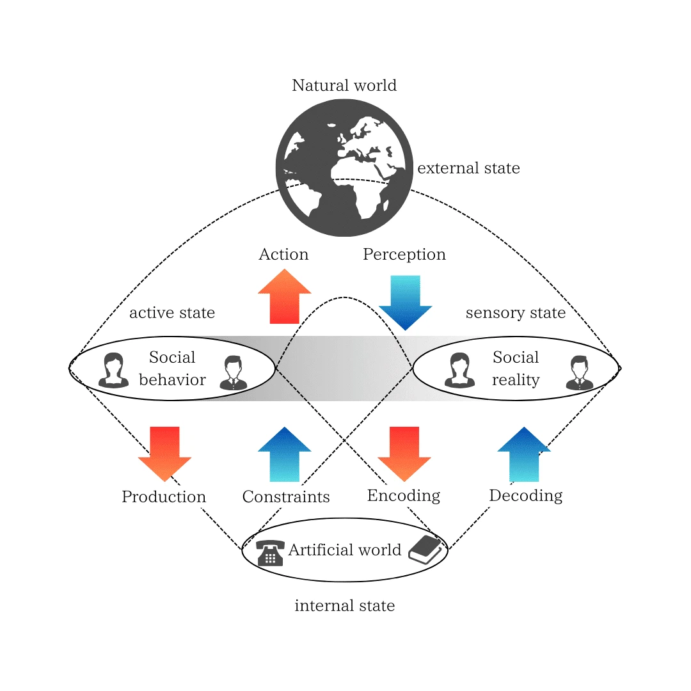
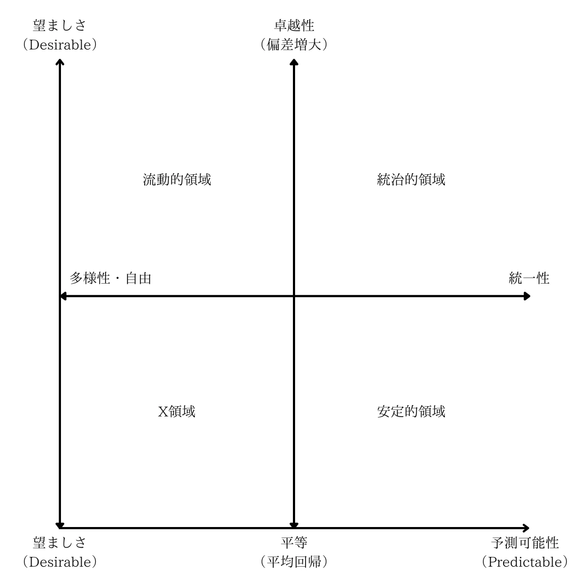
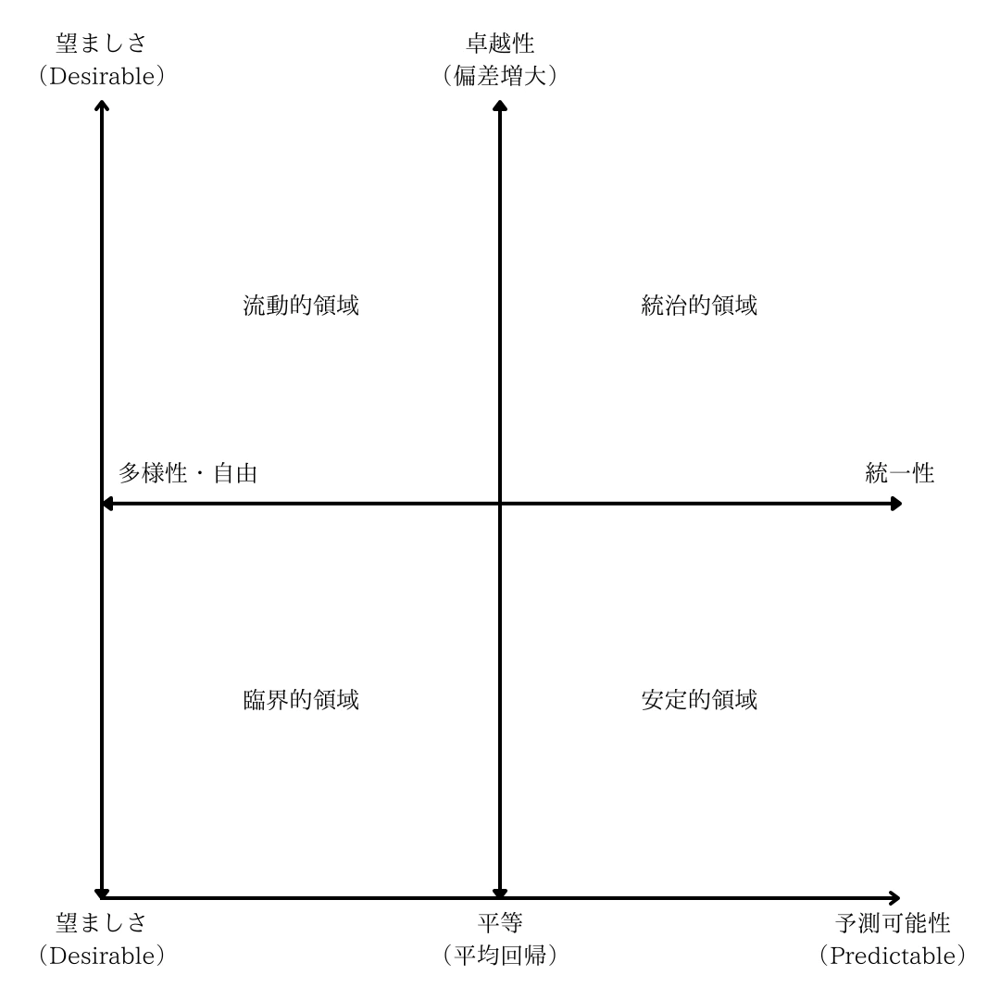
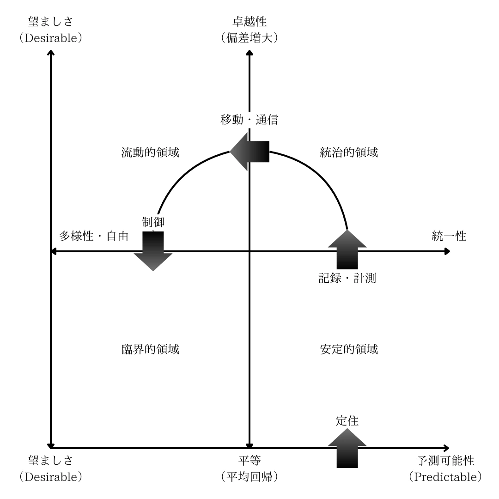
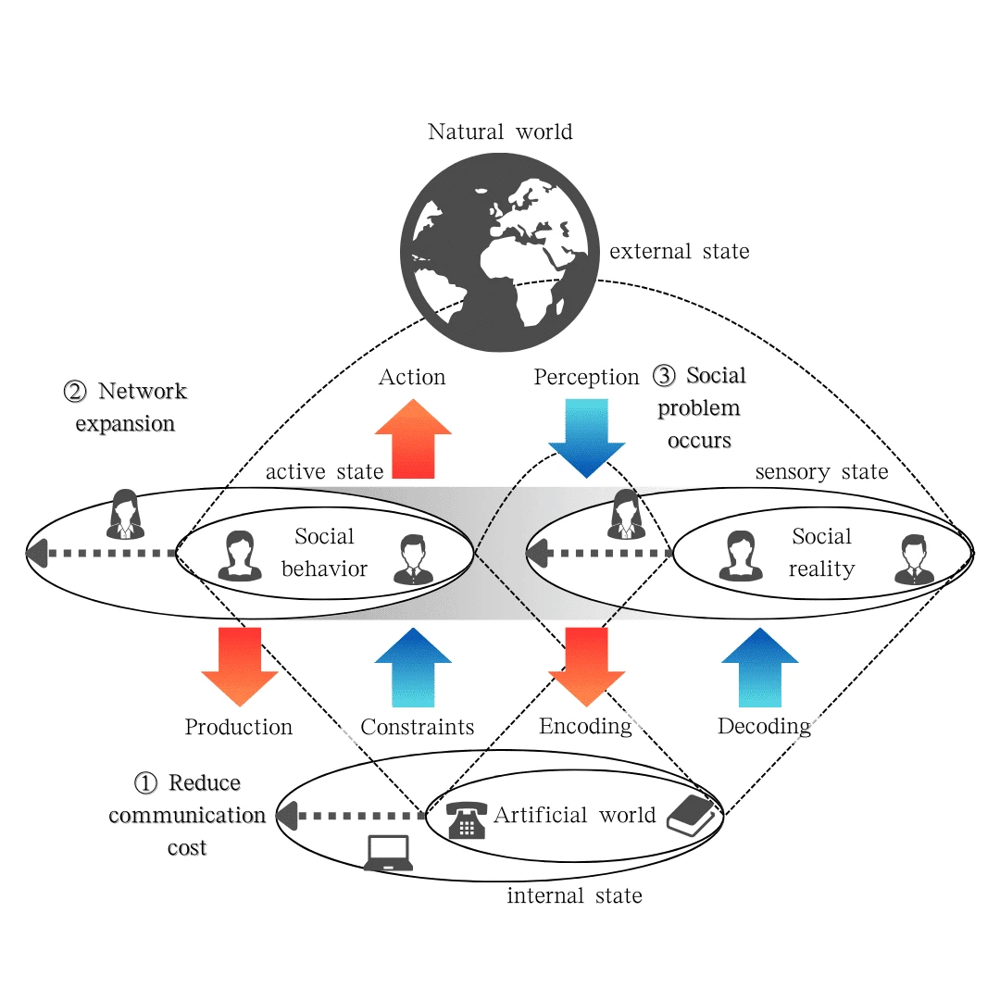
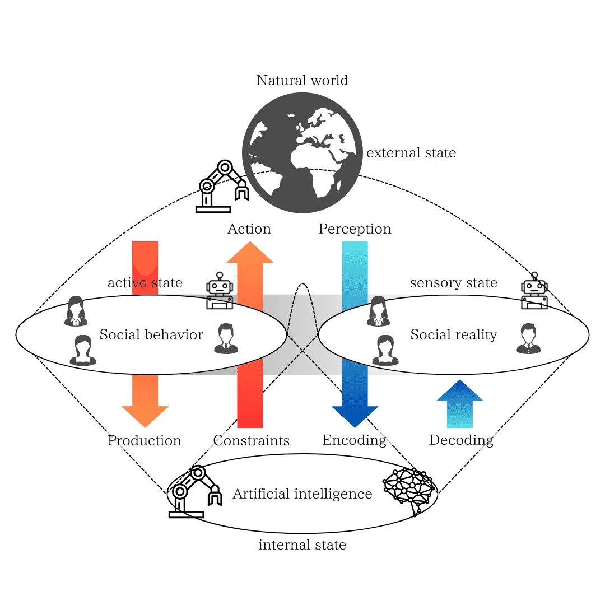

## Chapter 2: Materialistic Value Construction
This chapter takes as a crucial reference point the "theory of modes of exchange" developed by the contemporary Japanese thinker and critic Karatani Kojin in works such as Power and Modes of Exchange and The Structure of World History. Karatani analyzed historical social structures using a framework of four modes of exchange: A: Reciprocity (community), B: Plunder and Redistribution (state), C: Commodity Exchange (market), and D: X.   

This essay attempts to re-examine these modes of exchange from the perspective of materialistic principles of existence. Specifically, it is an attempt to reconstruct The Structure of World History based on the principles of life's existence by regarding the "universal forms of Truth, Goodness, and Beauty," inspired by the "dynamics of belief" in the previous chapter, as what Karatani calls "power," and interpreting the "modes of dependency" derived therefrom as concepts corresponding to the "modes of exchange."

### 2.1 Information-Theoretic Worldliness
The driving force behind human society constructing an "artificial" world, distinctly different from the natural environment, can be sought in the "physical laws" of the world. In particular, "conservation laws" concerning energy and matter provide a fundamental motivation that human "work"—that is, the activity of transforming "things" and "energy" into specific forms—is by no means valueless. This is because the conservation of things forms the basis of a "predictable reality" for life. And the work of producing things, by building upon and accumulating a "desirable reality" on that stable foundation, can create a "harmonious reality," thereby becoming a "pursuit of Goodness."

The "world of things" thus created becomes an environment for the life existing within it, fostering adaptive values within the relationships between one's own body and various things (based on physical laws). Surveying history, the "work" of people transforming the world of things itself came first, and the resulting transformed physical and artificial environment subsequently influenced the lifestyles and values of succeeding generations. This characteristic, where the production of things conditions people's living environment and prompts changes in values, aligns with a materialistic view of history, underpinned by the condition of the conservation of things.

> Work corresponds to the unnaturalness of human existence, which is not embedded in, and whose mortality is not compensated by, the species’ ever-recurring life cycle. Work provides an 'artificial' world of things, distinctly different from all natural surroundings. Within its borders each individual life is housed, while this world itself is meant to outlast and transcend them all. The human condition of work is worldliness.
Hannah Arendt, The Human Condition   

To understand more deeply the influence of this "world of things" on value formation, let us change perspective and reconsider the "world of things" as a "world of information." This is an attempt to reinterpret the concept of "worldliness" discussed by Hannah Arendt (the human environment generated and maintained by work, persisting across generations) from the viewpoint of information conservation, transmission, and reference. The core of Arendt's "worldliness" was that the "things" created by humans persist on a timescale different from natural cycles, possessing the power to shape and transform the thoughts, actions, and values of subsequent generations beyond the birth and death of individual lives. That is, certain structures embedded in the environment through "work" are passed down through generations, functioning as a stable "public realm" connecting lives.

Redefining this Arendtian "worldliness" within an information-theoretic framework might look like this:

Information-Theoretic Worldliness: An information structure established in the external environment that life (or society) can mutually utilize and reference across generations. Being relatively stable beyond the lifespan of individual lives, it functions as a "common external reference frame" for learning and coordination for society, including newcomers.

Based on this definition, "things," the products of "work," function not merely as matter but as media that hold specific information and transmit it to the future. They act as society's "external memory" or "external resources," reducing uncertainty for individual agents predicting the world and acting, while also having aspects that constrain thought patterns and behaviors.

Furthermore, this information structure is preserved over long periods through recording media (objects, books, digital data, etc.), enabling stable information sharing across generations and communities, and promoting the accumulation and transformation of social order, knowledge, and values. There exists a dynamic interaction between the internal states of life (knowledge, beliefs) and information embedded in the media of the external world. Life records and encodes (Encoding) wisdom and culture into the external world, and other lives read and decode (Decoding) it to update their own internal models. This continuous back-and-forth movement of externalization and internalization is precisely the mechanism that dynamically maintains and develops "worldliness."

More importantly, it is conceivable that shared worlds of meaning, such as language and symbol systems, emerge and are maintained through the mutual use of this stable information-theoretic worldliness as a common reference frame by numerous agents engaged in active inference. Recent attempts frame this process as "Collective Predictive Coding," providing a perspective that understands society itself as a kind of macroscopic active inference agent, constantly updating its collective internal model (shared knowledge, norms, values) while adapting to the environment.   

That is, from the standpoint of this information-theoretic worldliness, the physical media and infrastructure where symbols are actually recorded, processed, and referenced can be regarded as society's "internal model." In other words, the true image of our society is a macroscopic Markov Blanket structure (Figure 3: Artificial Markov Blanket, AMB) that bounds the group of agents producing, recording, and referencing information-theoretic worldliness, separating them from the natural environment with which they interact. The existence of this artificial information processing structure is the fundamental characteristic distinguishing human society from natural ecosystems.

||
|:--:|
|Figure 3: Artificial Markov Blanket (AMB)|

Figure 3 is a conceptual diagram viewing human society and the artificial world as a whole as a macroscopic Markov Blanket. The "Natural world" depicted at the top represents the totality of the external environment and physical laws influencing society. The "Artificial world" at the bottom refers to the human-made artificial infrastructure, such as technology and media. In the central gray band, "Social behavior" and "Social reality" are distinguished, and the structure shows that active inference for society as a whole is realized through both acting as boundary conditions interacting with the natural and artificial worlds.

Between the artificial world and social behavior, bidirectional arrows labeled "Production" and "Constraints" are drawn. This indicates a dynamic relationship where society "produces" new technologies and media, while these, in turn, "constrain" people's behaviors and values, reinforcing or transforming the existing order (mutual harmony).

The arrows "Encoding" and "Decoding" between the artificial world and social reality represent how social reality can be transformed through the exchange of information in the artificial world (via books, data, communication, etc.). Phenomena such as the redefinition of social reality and the formation/diffusion of new values can be explained here.

Meanwhile, the red and blue arrows "Action" and "Perception" at the top indicate interactions with the natural world and their feedback. Social behavior affects the natural environment, and the perceptual information from it is encoded in the artificial world through social reality, subsequently updating social behavior. Thus, a bidirectional cyclical structure also exists between the natural world and society.

Overall, this diagram suggests a process where the three layers—"Natural world," "Social behavior/Social reality," and "Artificial world"—are interconnected by their respective unique feedback pathways, constantly generating, maintaining, and expanding society in a stable manner.

As a proposition of this essay, I consider the establishment and maintenance of this technological and informational structure (AMB) to be the primary condition for the establishment of "governance." That is, consensual agreements like the "social contract," traditionally seen as the basis of governance, are considered to be formed secondarily as people adapt and interact within the process of this AMB, the technological and informational foundation, gradually being established.

### 2.2 Self-Referentiality
> A characteristic of human society is institutions formed as a result of actions that anticipate emergent phenomena. The emergence of such recursive institutions is called 'second-order emergence' and can be said to be one of the salient features distinguishing human society from animal society.
Nigel Gilbert, Simulation for the Social Scientist (Translation based on Japanese text)   

The "worldliness" discussed in the previous section, rooted in physical laws and re-examined information-theoretically, provided the artificial and physical foundation distinguishing human society from the natural environment. This section shifts focus to human society itself as it unfolds upon this physical and informational foundation, particularly highlighting its characteristic of Self-Referentiality. Human society is characterized by a recursive loop, "second-order emergence," where it anticipates emergent phenomena it causes and forms institutions in response. To deeply understand this self-referential nature, let us begin by reformulating concepts like "cost" and "function," used in economics and sociology, in line with the context of this essay.

First, let's introduce the concept of Transaction Cost. Here, we distinguish two different phases of transaction cost.

The first phase refers to losses accounted for in the process of generating mutual harmony. This includes not only the consumption of physical resources (matter, information, space, means of transport, etc.) associated with the transformation and movement of things and energy but also intangible elements such as opportunity loss, increased risk, and mental burden. Furthermore, in the ultimate situation for living beings, where survival itself is threatened, the very mortality of life is incorporated as the maximum transaction cost. These losses are direct factors or risks that destabilize or potentially collapse life's harmonious reality and are fundamentally recognized as "evil."

The second phase concerns losses accounted for in maintaining a specific society during the repetitive process of mutual harmony. Losses in this phase are characterized by being primarily recognized from a synchronic perspective, i.e., from the viewpoint of maintaining the structure and balance of social relations at a specific time. Specifically, in addition to the losses of resources and opportunities mentioned in the first phase, it includes costs for maintaining and complying with socially constructed and institutionalized modes of dependency (reciprocity, plunder and redistribution, commodity exchange, etc.) (e.g., the burden of gift-giving, fulfillment of obligations, inconveniences associated with rule compliance) and the risk of sanctions for deviation. These costs are evaluated and justified (implicitly or explicitly) by people in society as "good" for avoiding the "evil" of societal collapse and maintaining a stable harmonious reality, or as acceptable "necessary evils."

Next, let's introduce the concept of Function. Function is a concept based on the recognition of the causal relationship wherein an event (input) produces a certain value (output) for a specific subject. If the subject positively evaluates the output result, deeming it akin to "Truth, Goodness, Beauty," it is called Eufunction. If negatively evaluated, deeming it akin to "Falsehood, Evil, Ugliness," it is called Dysfunction. Furthermore, if the function was intended and anticipated beforehand, it is classified as Manifest Function; if it appears unintentionally and unexpectedly, it is Latent Function.

Positioning these two concepts, transaction cost (especially the second phase) can be said to be a concept for analyzing through which specific modes of dependency mutual harmony in society is maintained and reproduced. For example, comparative institutional analysis using the transaction cost concept discusses the efficiency and characteristics of different social institutions (markets, firms, states, communities, etc.) by comparing what transaction costs each saves or incurs.   

On the other hand, function is a concept for analyzing based on what belief systems or values subjects involved in mutual harmony evaluate events and choose actions. For example, this includes Functional Equivalence Analysis, which identifies the diverse functions (eufunction/dysfunction, manifest/latent) of a certain institution or policy and examines whether the same eufunction (value) can be achieved by different means.

That the concepts of cost and function are not mere theoretical constructs but are tied to concrete practices in the real world can be seen from the following examples. Corporate and national accounting reports and organizational charts are nothing less than attempts to grasp and optimize second-phase transaction costs (costs related to money and authority). Also, when policies are planned and evaluated, it is customary for their diverse functions (expected effects and potential risks) to be qualitatively and quantitatively inferred and used as judgment material.

As argued in the previous section, the establishment of a foundation capable of stably storing, transmitting, and referencing information across generations—namely, "information-theoretic worldliness"—was the fundamental condition for governance to be established. To grasp this foundation more concretely, it is none other than the technology and practice of measurement and recording of societal states and activities. Systems of measurement and recording, such as writing, numbers, maps, and statistics, function as society's external memory, converting complex and extensive social phenomena into information that can be grasped across time and space.

This informational foundation based on measurement and recording became the decisive factor for the advanced development of society's self-referentiality. Through the records it produces, society becomes capable of objectively observing and analyzing its own state and changes (as if in a "mirror reflection"). This made the operation of large-scale governmental societies—previously impossible, such as tax collection, resource management, and law application in extensive states—a reality.

And this self-referential process based on measurement and recording is also an important condition for the idealistic aspect of human history, namely, for values and ideas to have the power to move society. This is because, through the objectified perception of society, people come to conceive and embrace an image of "what society should be," i.e., an "ideal." The recognition of patterns and problems indicated by social records leads to the desire to improve them and to the formation of new values. This is precisely the mechanism of "second-order emergence," where macro information structures influence micro individual values and ideas, becoming a driving force for social transformation.

This essay posits the following four ideals that society can pursue, placed in opposition:

Equality: An ideal aiming to reduce deviations between individuals, oriented towards homogeneity and stability. An aesthetic sense that finds desirability in regression to the mean.
Excellence: An ideal aiming to increase deviations between individuals, oriented towards the prominence of specific individuals or capabilities. An aesthetic sense that finds desirability in increasing deviation.
Unity: An ideal seeking to enhance the order and predictability of society as a whole by constraining individual actions and choices.
Diversity/Freedom: An ideal aiming to minimize constraints on individual actions and choices, promoting free activity and the expression of differences. Freedom through non-restraint.
These four ideals are considered not to exist independently but rather to form two axes of opposition in a trade-off relationship: the axis of "Equality vs. Excellence" and the axis of "Unity vs. Diversity/Freedom." Which tendency is emphasized more varies depending on the situation, purpose, or the subject's belief system, and both can be affirmed and considered ideals in specific contexts.

The four quadrants formed by orthogonalizing these two axes are thought to represent different aspects of the social domain.

||
|:--:|
|Figure 4: Four Quadrants of the Social Domain|

Stable Domain: A domain where Equality and Unity are emphasized. Typically includes groups like communities, collectives, and families based on people's homogeneity and mutual aid.
Governmental Domain: A domain where Excellence (prominence of specific power or ability) and Unity (discipline, hierarchy) are emphasized. In real society, organizations of various scales, such as states and corporations, are established here.
Fluid Domain: A domain where Excellence (selection of winners through competition) and Diversity/Freedom (individual free choice) are emphasized. In real society, this is established as large-scale Markets.
X Domain: A domain where Equality and Diversity/Freedom are pursued simultaneously. This domain breaks away from traditional economic and political structures of domination, formed based on free association through pluralistic and autonomous solidarity and cooperation, i.e., association. Therefore, concrete social examples include cooperatives, voluntary civic movements, local currencies, gift economies, and online open-source communities.
These correspond structurally to the four-quadrant framework discussed in relation to the modes of exchange proposed by Karatani in The Structure of World History and Power and Modes of Exchange. In particular, the X domain, where Equality and Diversity/Freedom intersect, will be discussed in detail in the next section.

### 2.3 Universal Criticality
First, let us confirm the methodological perspective underlying the discussion in this section. "Constructivism / Generative Approach" refers to a methodology, or the theoretical system obtained thereby, that aims to understand the generation mechanism of a phenomenon and verify the validity of assumed basic principles by conducting simulations (mock experiments) using computational models based on those principles, and observing the spatiotemporal patterns that emerge. Through the constructivist approach, we can understand complex world events more deeply not just as static structures but as dynamic generative processes.

The interdisciplinary field applying this constructivist methodology to elucidate social and historical phenomena is called "Artificial Society Studies" or "Computational Social Science." These approaches aim to clarify how complex social order and unexpected macro-phenomena "emerge" from the interactions of numerous constituent agents of society, each acting based on limited information and simple rules.

From a constructivist perspective, society and history are viewed not as fixed entities but as dynamic processes constantly fluctuating due to interactions among numerous agents, capable of branching into diverse paths. Simulations using computational models become powerful tools for analyzing this dynamism. For instance, Agent-Based Modeling (ABM) is a representative method that models individual subjects as autonomous "agents" and observes/analyzes how the dynamics and patterns of the entire society are generated by having them interact based on given behavioral rules.   

While ABM is a major method in contemporary computational social science, the underlying idea—that macro-order and complexity emerge from local interactions between simple elements—can trace its roots back to research on earlier computational models like the Cellular Automaton. Cellular automata, despite being simple models where the state of a grid space (cell) changes simultaneously based on the states of adjacent cells, possess the ability to generate surprisingly diverse and complex patterns. Research on such models, connecting also to Stephen Wolfram's Principle of Computational Equivalence, strongly impressed upon us the probability that many phenomena in the world, including the natural world, are fundamentally computational.   

However, many elementary computational models have dealt with frameworks assuming uniform and invariant rules for all constituent elements, updated synchronously. Under such frameworks, complex and adaptive behavior was thought to be realized only in the critical state known as the "edge of chaos," the delicate tension between order and chaos, or regularity and randomness. But this criticality at the "edge of chaos" is extremely sensitive to changes in rules or parameters. Slight changes in conditions easily shift the system towards either order or chaos, making it insufficient to explain the robust adaptability of systems like living organisms that maintain themselves stably while exposed to environmental fluctuations. Why such robust systems can exist has remained, in part, a difficult-to-explain issue (a hard problem).   

Recent research, particularly using cellular automata, is forcing a major shift in this picture. In models like "Asynchronously Tuned Elementary Cellular Automata (AT-ECA)," which introduce asynchronous rule application and a mechanism for "local rule adjustment," the system autonomously exhibits critical behavior regardless of whether the underlying (synchronous, uniform) rule is chaotic or orderly. This means criticality appears "universally" without specific parameter tuning, and is called "universal criticality."

This universal criticality holds the potential to overcome the fragile image of the "edge of chaos" based on synchronous, uniform, and invariant rules. By introducing asynchronicity and local rule adjustment, the system can self-organize robust adaptability against external environmental fluctuations and internal parameter changes.

From here, the discussion proceeds based on analogy. The mechanism of "local rule adjustment" introduced in the AT-ECA model seems structurally isomorphic to the process of updating internal states (beliefs) via the Markov Blanket in the Free Energy Principle (FEP) discussed earlier, and to learning/adaptation processes represented by Hebbian learning in neuroscience, where synaptic connection strengths change through interaction. That is, it's a loop structure where the way of interacting (the rule) itself changes according to the result of the interaction. Furthermore, systems like AT-ECA that maintain boundaries with the outside through local adjustments can themselves possibly be viewed as structures possessing a kind of macroscopic Markov Blanket.

However, the analogy here is merely an intuitive suggestion for exploring theoretical possibilities. It must be clearly stated that rigorous bridging between these different theoretical domains (complex systems science, information theory, neuroscience, statistical physics, etc.) requires further theoretical and empirical demonstration.

But if we assume this analogy holds some validity, interesting implications arise. Namely, if "things" possessing a Markov Blanket (boundary structures distinguishing internal from external, self-maintaining through interaction)—such as atoms, molecules, cells, individuals, social systems—exist universally in the cosmos, and if they interact asynchronously and perform local adjustments (learning/adaptation), then perhaps our universe possesses the property of universally heading towards a state of universal self-organized criticality, without extreme dependence on specific physical constants or initial conditions.

If so, our view on how complex structures like life, consciousness, and society can exist in this universe might change significantly. If universal criticality makes self-organization a more common, universal phenomenon, then these complex entities would cease to be miraculous products presupposing miraculous fine-tuning of physical constants or extremely rare initial conditions. Their origin and maintenance might no longer be fundamentally unsolvable "hard problems."

Such a perspective contrasts with approaches that introduce certain transcendental explanatory principles, such as the "Anthropic Principle," which concludes the universe must have special properties convenient for humans for us to exist, or classical "Social Contract theory," which posits the (implicit or explicit) agreement of rational individuals as the foundation for society's establishment.

That is, the concept of universal criticality firstly suggests the possibility of understanding the origin and evolution of complex entities in our universe, including life and society, as a more natural physical process without special assumptions. Secondly, it holds the potential to provide theoretical insights into a more realistic and practical theory of social formation: how stable social order can be formed and maintained through local interactions and adjustments, even if individual agents are not necessarily fully rational or possess a complete overview of the whole.

Finally, let us connect the discussion of universal criticality developed in this section to the four-quadrant framework of societal ideal types presented in the previous section (Figure 4). In the previous section, the lower-left region where the value axes of "Equality" and "Diversity/Freedom" intersect was held in reserve as the "X Domain." This essay proposes that this X Domain corresponds precisely to the social state characterized by the concept of universal criticality discussed in this section—namely, a state that self-organizes to maintain the boundary between order and chaos and exhibits robust adaptability. Therefore, henceforth, this X Domain will be referred to as the "Critical Domain / Society," and its properties and significance will be further explored.

Note that the "Critical Domain" here refers to the stage where universal criticality manifests most persistently and prominently, not meaning that critical phenomena themselves do not exist in the other three domains. Local and temporary critical states can certainly occur in the Stable, Governmental, and Fluid domains as well. However, in the X Domain, the strongly tensional value axes of "Equality" and "Diversity/Freedom" constantly compete, causing the system to be self-organizedly drawn towards the boundary of order and chaos, making criticality likely to appear as the norm. It is due to this characteristic that this essay specifically designates the X Domain as the "Critical Domain."

||
|:--:|
|Figure 5: Four Quadrants of the Social Domain (Revised)|

### 2.4 The Constitution of World History
Through the discussions up to the previous section, we have gained the perspective of viewing society as a vast information processing system exchanging information between the natural and artificial worlds, maintaining and developing itself—namely, as an Artificial Markov Blanket (AMB). We also discussed how society possesses a self-referential process of measuring and recording its own state and pursuing ideals (Equality, Excellence, Unity, Diversity) based on that, and the possibility that its dynamics, under certain conditions, exhibit universal criticality, leading to an adaptive and robust "Critical Society."

This section integrates these concepts and attempts to reinterpret the driving force behind the structural changes throughout human history, namely Karatani's The Structure of World History, from a materialistic perspective. We focus particularly on the evolution of the technological base (AMB evolution) and the resulting transitions in society's primary modes of dependency (modes of exchange).

Figure 6 schematically shows the transition of dominant social domains in world history. Similar to the previous section (Figure 4), it divides the social domain into four (Stable, Governmental, Fluid, Critical). Figure 6 schematically illustrates how the dominant social domain in world history has transitioned with technological innovation. Thick arrows indicate the direction in which technological innovation tended to shift society.

||
|:--:|
| Figure 6: The Constitution of World History|

First, as Karatani points out, "sedentism" (the beginning of agriculture and animal husbandry) was the major technological base that led human society into the "Stable Domain." With stable food production and increased predictability due to settlement, people formed land-based communities and strengthened relationships of mutual aid based on reciprocity (gift and return). Here, a stable society emphasizing intra-group "Equality" and "Unity" becomes dominant. This corresponds to the society where Karatani's Mode of Exchange A (Reciprocity) is prevalent.

Next, the invention of "recording and measurement" technologies (writing, weights and measures, calendars, etc.) became a force pushing society towards the "Governmental Domain." These technologies enabled the management and mobilization of people and resources over wide areas, dramatically increasing society's information processing capacity as an AMB. This led to the formation of large-scale states characterized by the "Excellence" of specific rulers (kings, priests, etc.) and the "Unity" of laws and bureaucracy. There, Mode of Exchange B, such as plunder and redistribution (or patronage and obedience), becomes dominant. Measurement and recording enhanced society's self-referentiality and established the foundation of governance.

Subsequently, the development of "mobility and communication" technologies (navigation techniques, printing, telegraph/telephone, and the modern internet) significantly shifted society towards the "Fluid Domain." The dramatic reduction in mobility and information communication costs led to the formation and expansion of extensive networks transcending geographical constraints, driven almost by thermodynamic randomness (Figure 7), explosively increasing people's "Diverse and Free" activities (movement, trade, information exchange).

||
|:--:|
|Figure 7: Changes in AMB accompanying the development of mobility and communication technology|

This figure suggests that the development of mobility and communication technology (① reduction in mobility/communication costs) leads to the expansion of social networks (②), while accelerating interaction and fusion between different AMBs, potentially causing new social problems (③, e.g., global disparities, environmental issues, pandemics).

Amidst this heightened fluidity, commodity exchange mediated by money (Mode of Exchange C) permeated every corner of society, and market mechanisms maximizing "Excellence" (winners through competition) and "Diversity/Freedom" (individual choice) gained dominant power.

And today, we are facing a new technological turning point with "control" technologies, particularly Artificial Intelligence (AI) (Figure 8).

||
|:--:|
|Figure 8: Artificial intelligence (AI)|

This figure depicts a situation where AI is integrated into the AMB structure of society itself. AI influences not only the "internal state" (information processing, knowledge generation) of the artificial world but also "action" and "perception" (sensors, robots) towards the natural world, holding the potential to transform production methods, social decision-making, and even human cognition and values themselves.

These advanced information processing and control technologies hold not only the potential for mere efficiency improvements or enhanced management but also the latent power to steer society towards the "Critical Domain" (lower left in Figures 4 and 5), pursuing values previously considered difficult to reconcile (e.g., Equality and Diversity/Freedom). If AI and network technologies can be designed and operated in a way that promotes the self-organization and adaptation indicated by the universal criticality discussed in the previous section, could it open up the possibility of realizing a "Critical Society"—a society that is robust against change, allows for the free activities of diverse members, yet maintains overall harmony (equality, sustainability) without excessive reliance on top-down control (Unity) or fierce competition (Excellence)?

Here, we face a fundamental question: If advanced control technologies, including AI, bring society closer to the domain of universal criticality, does this signify not just another stage in history, but a qualitative transformation in the very nature of history itself? More boldly, might it herald the end of "materialistic history," where the material and technological base strongly determined social structure, and the beginning of an "idealistic history," where human ideas—values and ideals—more directly shape society?

This is because if the yoke of material scarcity is relatively alleviated in the critical domain, and the center of value creation shifts towards non-material realms like knowledge, information, and creativity, then what determines the form and direction of society may no longer be the mode of production itself, but rather the idealistic choices we make: which "Truth, Goodness, and Beauty" we aspire to, and what kind of society we envision as "desirable." As society's self-referentiality becomes extremely high, acquiring the ability to recognize its own state and reorganize itself based on ideals (ideas), history begins to take on the appearance of a process of the self-realization of ideas.

What becomes crucially important at this turning point is the practical question of which "ideas"—that is, which harmony of "Truth, Goodness, and Beauty"—we choose, and how we weave them into social reality. The future is not predetermined; it is being generated right now, in the interaction between our value choices and the material and technological foundations that support them.

Viewed this way, Karatani's proposed modes of exchange A (Reciprocity), B (Plunder and Redistribution), C (Commodity Exchange), and D (X) can be understood not merely as indicating idealistic forms of exchange, but as "materialistic modes of dependency" adaptively formed by people to survive and maintain society, accompanying the development of historical technological foundations (like information processing technology and means of production). That is, under the constraints of technological conditions and resource distribution in each era, everyone has reorganized relationships with others to ensure their own safety and prosperity. This, as a result, is thought to have formed the specific social structures categorized as Modes of Exchange A through D.

From this perspective, forms like A (Reciprocity), B (Plunder and Redistribution), and C (Commodity Exchange) can be seen as "survival strategies" indicating how humans exchanged resources, formed order, and coordinated their actions. Mechanisms like gift-giving and return, patronage and obedience, and fluidization through commodity exchange functioned as adaptive measures within material constraints, underpinned by natural and technological imperatives to stably reproduce society.

Furthermore, reaching the stage corresponding to Karatani's D (X), symbolized by the emergence of AI and advanced control technologies, the establishment of a new level of "informational and material foundation" brings the potential to relativize conventional relations of domination and market competition. This signifies society's transition towards a stage of "idealistic co-creative relationships," yet behind it lies the indispensable foundation of efficient collaboration and decentralization enabled by information technology and networks. In other words, the stirrings of a critical society capable of simultaneously aspiring towards "freedom and equality" do not arise purely from idealistic ideals alone but are underpinned by extremely materialistic dimensions—new developments in technological constraints and informational infrastructure.

Philosophers who have slighted materialism and discussed history centered on idealism have lost sight of the influence of matter that constantly holds us captive, attempting to imagine idealistic canopies detached from the foundations of reality, like classical social contract theory. But however high thought may soar, our endeavors have never escaped the gravity of this material world.

**Translated by Gemini 2.5 Pro**