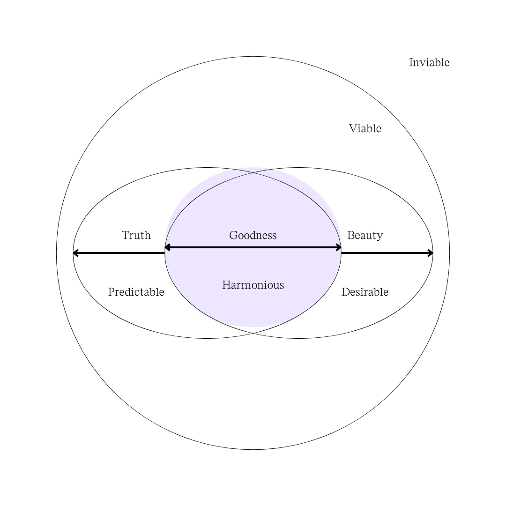

## 1章 原理的価値構成

－価値創発システムへの試論
はじめに、この試論は「1.1 真善美の普遍的形式」から読み始めてもよい。この節は「1章 原理的価値構成」の核心であり、以降の章の前提である。

それ以前の節は、本章の核心に至る理論的背景を示したものである。主に「自由エネルギー原理」についてであるが、この試論で提示する理論に対しては、あくまで援用という位置づけにとどまる。そのため、1.1節以降の議論へは、それ以前の部分（1.01節～1.03節）を読まずに進むことも可能である。しかし、原理的な探究に関心のある読者にとっては興味を惹くものだと思う。

### 1.01 信念の形式
私たちの知覚は、単に外部からの刺激を受動的に取り込むプロセスではない。知覚とは、内面に生じる心象のはたらきである。こうした心象のはたらきを捉える際、心理学では構成概念（construct）を仮定する。構成概念とは、直接観察できない内面や心理過程を説明するため、便宜的に定められる理論上の概念を指す。ここでは構成概念の一例として、私たちが「現実はこうなるだろう」と予測する信念と、「世界はこうあるだろう」というア・プリオリ（先験的）な信念をもつと仮定する。

私たちは、信念に基づく予測と異なる現実が生起したとき、驚きを感じる。知覚の意味（価値）からすれば、現実は期待通りであるほどよいため、私たちは信念を絶えず更新し、現実と予測の差異を減らそうと調整すると考える。これをア・ポステリオリ（経験的）な信念の獲得として位置づける。

ここでいう「信念（belief）」とは、確率論の哲学的な解釈における二大潮流の一つ、「ある対象についての信念の度合いとして確率を捉える」という立場に基づく。そこで、はじめに「現実はこうなるだろう」と予測する信念を確率的に形式化する。

具体的には、事象${o}$がどれほど起きやすいかという信念の度合いを確率${p(o)}$で表す。そして、事象${o}$が生起したことに対する驚き（サプライズ）の大きさを連続関数${f(p(o))}$で形式的に表す。これは、サプライズの大きさ${f(\cdot)}$が信念（確率）${p(o)}$に依存することを意味する。また、関数の連続性はサプライズに微小な変化をもたらす確率値の変化が、ある限定的な差異に収まることを意味する。サプライズ${f(p(o))}$は経験的に以下の性質を満たすと考えられる。

必ず起きると確信している事象${o}$の生起にはサプライズがない。つまり、${f(p(o))=f(1)=0}$である。

多少なりとも起きないと信じている事象${o}$の生起にはサプライズがある。つまり、確率${p}$の値域${[0,1)}$においてサプライズは正値をとる。

やや特殊な場合だが、事象${o}$の生起を内包する事象${O\supset o}$が生起したことを報せる通信の後に、事象${o}$が生起したことを報せる通信があったとする。このときの最終的なサプライズの和は、一度で事象${o}$が生起したことを知覚するサプライズと等しい。つまり、${f(p(o))=f(p(O))+f(p(o)/p(O))}$が成り立つ。これはサプライズ${f}$に加法法則${f(xy)=f(x)+f(y)}$が成り立つことを意味する。

これらの性質を仮定して導かれる${f(x)}$の微分方程式を解くと、${f(x)=c\ln x+d,~c<0}$という解を得る。これより、サプライズは次のように定義されるのが一般的である。

サプライズ（Shannon's surprise）の定義

確率${p}$の事象が生起したときのサプライズを
$$
-\ln p, ~(0<p\leq 1)
$$

と定義する。

このように信念を確率として形式化すると、サプライズは負の対数確率として導かれる。すると、生起すると信じる度合いが小さい（すなわち確率が低い）事象ほど、生起したときにサプライズが大きくなることが、負の対数関数の単調減少性によって自然に示される。

サプライズの定式化により、「現実は期待通りであるほどよい」という価値規範も「サプライズ最小化」として表される。先述では、サプライズ最小化は先験的な信念を更新し、経験的な信念を獲得する過程として位置づけられると仮定した。

そこで、「世界はこうあるだろう」という先験的な信念を形式化する。具体的に、世界の潜在的（不可知）な事態${x}$が成立していると信じる度合いを確率${p(x)}$で表し、その事態${x}$の下で事象${o}$がどれほど生起しやすいか（尤度）を条件付き確率${p(o\mid x)}$で表す。このとき、先に定義した確率${p(o)}$は、以下のように周辺化（marginalization）した形で得られる。
$$
p(o)=\int p(x)p(o\mid x)dx
$$

ここで任意の関数（確率分布）${q(x)}$を導入し、イェンセンの不等式（Jensen's inequality）を用いることで、サプライズ${-\ln p(o)}$の上界を評価することができる。以下はその代表的な導出過程である。
$$
-\ln p(o)=-\ln\int p(x)p(o\mid x)dx=-\ln\int q(x)\frac{p(x)p(o\mid x)}{q(x)}dx
$$

ここで、${-\ln}$は凸関数であるため、イェンセンの不等式を適用すると、
$$
-\ln p(o)\leq\int q(x)\left[-\ln\frac{p(x)p(o\mid x)}{q(x)}\right]dx=\int q(x)[\ln q(x)-\ln p(x,o)]dx
$$

そして、上式の右辺を汎関数
$$
F[q,o]:=\mathbb E_{q(x)}[\ln q(x)-\ln p(x,o)]
$$

と定義すると、
$$
-\ln p(o)\leq F[q,o]
$$

が得られる。すなわち、サプライズ（Shannon's surprise）${-\ln p(o)}$は、汎関数${F[q,o]}$の下界（あるいは${F}$がサプライズの上界）となる。ここで導かれた汎関数${F}$は「自由エネルギー（Free Energy）」として知られており、サプライズ最小化は、自由エネルギーを最小化する関数${q(x)}$を求める問題へと帰着する。このように、関数${q}$を変数として、汎関数${F}$の値を最小化する問題を「変分問題（variational problem）」と呼ぶ。

さらに、自由エネルギー${F[q,o]}$を以下のように変形できる。
$$
F[q,o]=\mathbb E_{q(x)}[\ln q(x)-\ln p(x\mid o)]\underbrace{-\ln p(o)}_\text{Shannon's surprise}
$$

ここで、ベイズの定理
$$
p(x\mid o)=\frac{p(x)p(o\mid x)}{p(o)}
$$

と、${p(o)}$は前述の周辺尤度である。上式からは、${F[q,o]}$とサプライズ${-\ln p(o)}$の差は、2つの確率分布の差異を測る尺度として知られるKL情報量（Kullback–Leibler divergence）であることがわかる。
$$
D_\mathrm {KL}[q(x)\mid\mid p(x\mid o)]=\mathbb E_{q(x)}[\ln q(x)-\ln p(x\mid o)]
$$

したがって、自由エネルギー最小化とは、${D_\mathrm {KL}[q(x)\mid\mid p(x\mid o)]}$を極力小さくするような${q(x)}$を求める問題、すなわちベイズ推論（Bayesian inference）における経験的な信念確率${p(x\mid o)}$に近似する問題と等価になる。

また、自由エネルギー${F[q,o]}$は以下の2つの式に変形できる。
$$
F[q,o]=\underbrace{-\mathbb E_{q(x)}[\ln p(o,x)]}_\text{energy}-\underbrace{\mathbb E_{q(x)}[-\ln q(x)]}_\text{Shannon's entropy}
$$
$$
F[q,o]=\underbrace{\mathbb E_{q(x)}[\ln q(x)-\ln p(x)]}_\text{complexity}-\underbrace{\mathbb E{q(x)}[\ln p(o\mid x)]}_\text{accuracy}
$$

第一の式は、自由エネルギーを「エネルギー（energy）」と「エントロピー（Shannon's entropy）」の項に分解して解釈する視点を提供する。ここで「エネルギー」項は、信念${q(x)}$の下での世界の潜在的な事態${x}$と事象${o}$の結合確率${p(o,x)}$の対数の期待値（の符号反転）であり、系が「どれほど尤度の高い事態をとる可能性があるか」を測る指標とみなせる。エネルギーが小さいほど、信念 ${q(x)}$が仮定する事態の下で事象${o}$が生起しやすいことを意味する。

一方、「エントロピー」項は、系が成りうる潜在的な事態をどれだけ幅広く考慮しているかを示す指標である。このエントロピーが高いほど、信念${q}$は特定の事態に偏らず、多様な蓋然性を認める「寛容な」信念になっていると言える。ここで最大エントロピー原理（maximum entropy principle）に触れておく。この原理は、「与えられた制約条件を満たす分布の中でエントロピーが最大となる分布が、最もバイアスの少ない（無駄な仮定を加えない）分布である」と主張する。自由エネルギー最小化においてエントロピー項（の符号反転）が含まれることは、バイアスを避け、可能な限りエントロピーを高く維持しつつ観測を説明しようとする最大エントロピー原理の考え方と自然に整合することを示唆している。

続いて第二式では、「複雑さ（complexity）」と「精度（accuracy）」という2つの観点から自由エネルギーを解釈する。ここで、「複雑さ」項は事前分布${p(x)}$から近似分布${q(x)}$がどれほど逸脱しているかを示すKL情報量${D_\mathrm{KL}[q(x)\mid\mid p(x)]}$に対応する。言い換えれば、先験的な信念から大きく離れた経験的な信念を採用するほど、その分だけ「複雑さ」が増大することを意味する。

一方、「精度」項は、信念${q(x)}$の下で観測${o}$をどれだけうまく説明できるかを示す尤度（対数尤度）の期待値であり、観測データとの整合性を高めたいという要請を示している。すなわち、自由エネルギー最小化は統計的学習理論における「バイアスーバリアンス・トレードオフ」にも通じている。言い換えれば、これは、最高度の一般化と特殊な事象への最大限の適応を両立するような経験的な信念を獲得しようとする、適応的な要請を示している。

以上より、私たちの知覚プロセスは、サプライズ最小化という価値規範に基づき、ベイズ推論の近似である「変分自由エネルギー最小化」として形式的に記述できることがわかる。これは、私たちが「現実はこうなるだろう」という確率的な信念（予測）を抱き、その予測が外界からの経験（現象）によって覆されると驚きを感じ、その驚きを減らす方向へと信念を更新していく―こうした一連の心的プロセスを定式化したものである。この枠組みは、カール・フリストン（Karl Friston）が提唱する自由エネルギー原理（Free energy principle）と呼ばれる理論である。

### 1.02 自己証明

一方で、私たちの信念体系の内実を明らかにするには、知覚の領域にとどまらず「行動」の次元にも目を向けなければならない。私たちは単に外界を受動的に知覚し、その都度サプライズを減らすだけではない。未来を想像する予測的な心象を用いて、自らの行動を能動的に生み出しているのである。そして、行動プロセスもまた、サプライズ最小化という価値規範から理解できる。

例えば、ある状況で私たちは、「この行動をとれば望ましい結果が得られる（あるいは望ましくない結果は避けられる）」という予測をもつ。そして、予測と実際の結果との間に乖離が生じると、私たちはそのサプライズを最小化するために信念を更新する。このように、行動もまた知覚と同様、「サプライズ最小化」という価値規範に関わるプロセスとみなせるのである。

こうした観点から、未来の自由エネルギーの期待値である「期待自由エネルギー（Expected Free Energy）」という構成概念を導入するアプローチが考えられている。知覚プロセスを変分自由エネルギー最小化として記述したように、行動プロセスを「期待自由エネルギー最小化」として記述しようとする試みである。

まず、主体が未来にとる行動${a}$を考慮し、自由エネルギー${F}$の式に「未来にとる行動${a}$に依存する」という条件（${\mid a}$）を立項する。そして、未来に起こりうる事象${o}$と、その背景にある潜在的な事態${x}$を合わせた同時確率${q(o,x\mid a)}$ — 主体が近似的に用いている未来についての経験的な信念 — によって期待値をとる形式で、期待自由エネルギー${G}$を定義する。
$$
G(a):=\mathbb E_{q(o,x\mid a)}\left[\ln q(x\mid a)-\ln p(x,o\mid a)\right] 
$$

上式${G(a)}$を扱う際、しばしば${q(o,x\mid a)}$を${q(o,x\mid a)=p(o\mid a)q(x\mid a)}$という分解を仮定する。これは、潜在的な事態${x}$についての経験的な信念に基づいて、未来の事象の経験的な信念を表現できることを意味している。このとき、期待値演算子${\mathbb E_{q(o,x\mid a)}[\cdot]}$は二段階の期待値${\mathbb E_{p(o\mid a)}\mathbb E_{q(x\mid a)}}$に分解して扱うことができる。

さらに、${p(x,o\mid a)}$についても、しばしば${p(x,o\mid a)=p(x\mid o,a)\tilde p(o)}$のように分解し、${\tilde p(o)}$を「望ましい事象${o}$に高い確率を予期する先験的な選好（preference）」と解釈する。「選好」とは、意思決定の主体が選択肢に対して持つ好みを指す構成概念である。

こうした分解を踏まえて、期待自由エネルギー${G(a)}$を以下のように式変形できる。
$$
G(a)=-\underbrace{\mathbb E_{p(o\mid a)}\mathbb E_{q(x\mid a)}\left[\ln\frac{q(x\mid o, a)}{q(x\mid a)}\right]}_\text{epistemic value}-\underbrace{\mathbb E{p(o\mid a)}\left[\ln\tilde p(o)\right]}_\text{pragmatic value}
$$

第一項は「認識的価値（epistemic value）」と呼ばれる。これは、未来の事象${o}$によって潜在的な事態${x}$についての信念がどれほど更新されるかを表す、KL情報量
$$
D_\mathrm {KL}[q(x\mid o,a)\mid\mid q(x\mid a)]=\mathbb E_{q(x\mid a)}\left[\ln\frac{q(x\mid o, a)}{q(x\mid a)}\right]
$$

に対して、事象${o}$の生起確率${q(o\mid a)}$で加重平均（期待値）をとった量である。すなわち、${G(a)}$の最小化において、「多くの情報が得られる」（＝KL情報量が大きくなる）ような事象${o}$を予期した行動${a}$が選ばれる、という認識的・探索的な行動原理を表していると解釈できる。

第二項は「実利的価値（pragmatic value）」と呼ばれる。${\tilde p(o)}$が選好として与えられている場合、望ましい事象が予期されるほど大きくなる量である。したがって、${G(a)}$の最小化において、望ましい事象${o}$を実現する行動${a}$が選ばれるという実利的な行動原理を表していると解釈できる。

また、${\tilde p(o)}$を選好と解釈しない場合、単に${\tilde p(o)=p(o\mid a)}$とすると第二項は不確実性を表すエントロピーの形式となり、${G(a)}$の最小化は未来に予期される不確実性を最小化する行動原理を内含していると解釈できる。

このように、期待自由エネルギーという概念を導入することで、「サプライズ最小化」という価値規範の下、知覚と行動を一貫した形式で記述することができる。また、未来の不確実性を低減するためにより多くの情報を獲得しようとする認識的価値と、望ましい（あるいは不確実性の低い）未来に導こうとする実利的価値という、行動における2つの価値（意味）も明確となった。この定式化は、自由エネルギー原理の拡張として考えられた枠組みで、能動的推論（Active Inference）と呼ばれる。

能動的推論の思想では、このような知覚と行動の循環を、本質的に「自己証明（self-evidencing）」であると見なす。自己証明とは、自らの存在を常に証明していくプロセスのことである。すなわち、生命にとって「自己が生きていない現実」を心象に描くことは生来的に不可能であるがゆえに、最もサプライズのない事象である「生きる現実」を反復する結果、生命の生存は持続するのである。

以上をまとめると、「私たちがそもそも信念体系をもつ」という信念体系そのものを、サプライズ最小化や変分自由エネルギー最小化、期待自由エネルギー最小化という枠組みを通じて定式化できることが示された。すなわち、知覚と行動の循環が「驚きを減らす」という価値規範に基づき、ベイズ推論を近似するような「自己証明プロセス」として統一的に描けることがわかったのである。

ここに、私たちが「信念体系をもつ」という信念体系の内実を概念的に解明するという当初の目的はひとまず達成されたと言える。

### 1.03 信念の力学

> 6.3211 実際ひとは、なんらかの「最小作用の法則」があるに違いないと、それを精確に知る前から予感していたのである。（ここでもまた、例によって、ア・プリオリに確実なものは純粋に論理的なものであると分かる。）
ウィトゲンシュタイン『論理哲学論考』

ここまでは、私たちの心的プロセスを形式的に記述するために構成概念を仮定するという作法に則り、「心理学」として自由エネルギー原理を概説してきた。しかし、この原理が単なるモデル上の比喩にとどまらず、実際の物理的な存在論とどのように結びついているのかを考究することは、より根源的な理解のために不可欠である。そこで本節では、同じ自由エネルギー原理を今度は「物理学」としての視点から捉え直し、私たちの信念体系がいかに生成され、維持されるのか、その「力学」を明らかにしていくことにする。

力学とは、経験的な世界に対する私たちの信念体系を、一つのプランに従って公理的に構成しようとする試みに他ならない。すなわち、ここからは、その信念の動態（ダイナミクス）の根底にある力学、そしてそれを支配する先験的に直観される原理が考察の対象となる。

この「信念の力学」を提供する枠組みこそが、ベイズ力学（Bayesian mechanics）である。ベイズ力学は、物理システム、特に自己組織化する存在者（例えば生命体）が、あたかも自身が埋め込まれている環境についての確率的な信念を保持し、更新しているかのように振る舞うことをモデル化する。それは単なる比喩ではなく、システムの物理的なダイナミクス（物質的な側面）と、それが体現・符号化する信念のダイナミクス（情報的な側面）とを、原理的に結びつけようとする試みである。前節で形式化した自由エネルギー最小化という「信念更新の法則」は、このベイズ力学という、より広範な枠組みの中で、その生成原理と共に理解することができる。

では、その生成原理とは何か。それは、前節までに繰り返し登場した「自由エネルギー原理（FEP）」そのものである。FEPは、単に変分推論のアルゴリズムや自己証明プロセスの記述にとどまらない。それは、ニュートンの運動法則を導く最小作用の原理のように、存在者が存在者であり続ける（＝特定の構造、あるいは「らしさ」を維持する）ための根源的な要請、すなわち「先験的な原理」として位置づけられる。FEPが主張するのは、「もし何かが一定期間その構造を維持して存在するならば、それは必然的に、自身の環境に関する統計的な生成モデルを（暗黙的に）体現し、自由エネルギー（サプライズの上界）を最小化するように振る舞わなければならない」ということである。この原理こそが、前節で記述した信念更新（近似ベイズ推論）のダイナミクスを駆動する根源的なメカニズムである。

しかし、システムがどのようにして「信念を持つ」ことができるのか？ ベイズ力学とFEPは、「特定の分割（particular partition）」、すなわちマルコフブランケット（Markov Blanket）と呼ばれる境界構造の存在を鍵とする。マルコフブランケットとは、システムを、外部環境（External states:${\eta}$）から統計的に分離された内部状態（Internal states:${\mu}$）と、両者を媒介する境界状態（Blanket states:${b}$= 感覚状態${s}$ + 能動状態${a}$）へと分割する境界面である。この境界が存在することによって初めて、内部状態${\mu}$が外部状態${\eta}$に関する情報（すなわち信念、典型的には変分密度${q(\mu)}$のパラメータ）を符号化し、感覚状態${s}$を通じてその信念を更新し、能動状態${a}$を通じて外部に働きかける（自己証明を行う）というプロセスが意味を持つ。近年の研究（疎結合予想、Sparse Coupling Conjecture: SCC）は、十分に大きく複雑なシステム（生命体を含む）には、このようなマルコフブランケット構造が普遍的に（あるいは近似的に）備わっている可能性を強く示唆しており、この枠組みの一般性を担保している。

この原理（FEP）と構造（マルコフブランケット）の下で、「信念の力学」が具体的に展開される。内部状態（信念を符号化するもの）のダイナミクスは、自由エネルギーが最小となる方向へと駆動される。これは、信念が「統計多様体」と呼ばれる抽象的な信念空間上を移動する「フロー」として描かれる。このフローを導くのが、システムの「存在論的ポテンシャル（ontological potential）」である。これは、システムが「そのシステムらしさ」を維持するために必然的に向かうべき状態（定常状態密度、NESS）によって定義されるポテンシャルであり、その勾配が信念をあるべき方向へと導く力となる。このフローはさらに、ヘルムホルツ分解によって、環境の変化に応じて信念を修正する散逸的（垂直）フローと、現在の信念の下で可能な状態を探求する保存的（水平・ソレノイド的）フローに分解できることが示されており、信念ダイナミクスの複雑な様相を捉えることができる。

さらに、このFEPに基づく信念の力学は、「制約付き最大エントロピー原理（CMEP）」との双対性（duality）を持つことが明らかにされている。これは、システムの内部状態が自由エネルギーを最小化しようとするプロセス（FEP、内部からの視点）が、外部の観察者から見れば、システムがその存在を定義する特定の「制約」の下でエントロピー（不確定性）を最大化しようとするプロセス（CMEP、外部からの視点）と数学的に等価であることを意味する。この双対性は重要である。なぜなら、それは信念の力学（FEP）が、単なる情報処理のアルゴリズムではなく、エントロピー増大という普遍的な物理法則と矛盾せず、むしろその法則の中で「存在し続ける」という制約が生み出す必然的な帰結であることを示唆するからである。存在者が信念を持つということは、物理的な制約の中で可能な限り自由（エントロピー最大）であろうとする、存在そのものの原理的な現れなのである。

結論として、ベイズ力学は、自由エネルギー原理（およびその双対であるCMEP）を根底に置くことで、私たちの信念体系がいかにして力学的に生成され、維持されるのかについての原理的な説明を与える。存在者が自己証明プロセスを通じてサプライズを最小化しようとするダイナミクスは、単なる心理的な傾向ではなく、マルコフブランケットという構造を持ち、存在論的なポテンシャル（あるいは制約）に導かれる、物理法則に根差した必然的な力学なのである。

### 1.1 真善美の普遍的形式

概括すると、生命の本質は、自らの「生」という現実を維持し、反復することにある。特に、不確実性が低く、生存に適した望ましい環境、すなわち理想的な現実を安定的に反復しようとする存在であると言える。この理想状態は、「予期できる現実」であり、かつ「望ましい現実」であり、それが「生きる現実」と完全に一致する状態として概念化できる。本試論では、この理想的な状態を「調和的現実」と定義する。

しかし、現実の経験では、この理想的な調和が常に満たされるわけではない。この理想と現実の不一致こそが、生命が真善美という価値を追求する根源的な動機となる。以下に示すように、真善美のそれぞれは、「調和的現実」を成り立たせるための条件として明確に位置づけることができる。
「真」の追求: 「生きる現実」を「予期できる現実」へと近づける働きを担う条件（未知の解明・理解）。
「善」の追求: 「予期できる現実」と「望ましい現実」を一致・調和させる働きを担う条件（望ましい秩序の形成・維持）。
「美」の追求: 「生きる現実」を「望ましい現実」へと近づける働きを担う条件（理想や新奇性・創造性の感受）。

これらの位置づけを、より直観的に把握できる図を示す。この図は、生命が経験しうる現実の全体を表したベン図である。最も大きい円の外側は、「生存不能（Inviable）」な領域、内側は「生存可能（Viable）」な領域を表す。「生存可能」領域は、「予期できる（Predictable）」領域と「望ましい（Desirable）」領域を内包する。これら2つの領域は、それぞれ予測可能性や望ましさが一定の閾値を超えた部分を示しており、その重なり合う部分が、先に定義した「調和的（Harmonious）」領域である。

図中の三本の矢印は、各領域を拡張する方向を示しており、それぞれ「真（Truth）」「善（Goodness）」「美（Beauty）」の追求がもたらす効果を象徴している。すなわち「予期できる現実」「調和的現実」「望ましい現実」の拡大・維持作用を表す。

||
|:--:|
|*図1：真善美の調和的構成*|

真（Truth）の追求は、「予期できる現実」の領域を拡大する。
善（Goodness）の追求は、「予期できる現実」と「望ましい現実」の重なりである「調和的現実」の領域を拡大・維持する。
美（Beauty）の追求は、「望ましい現実」の領域を拡大する。

このように、真善美の追求は、それぞれ「予期できる現実」「望ましい現実」そして「生きる現実」という3つの側面を重ね合わせ、「調和的現実」を実現するための条件として機能する。完全な「調和的現実」は常に達成されるわけではない。むしろ、その不完全さや不一致があるからこそ、生命は未知を探求し（真）、理想を描き、新たな可能性を感じ取り（美）、現実をよりよい方向へ変えようと努める（善）ための根源的な動力を得るのである。

真善美は、生命が置かれた状況に応じて異なる側面から作用するが、究極的には「調和的現実」という共通の目的に向かう、相互補完的な「力」を形成している。この生命を中心とした三価値の相互補完的な統合こそが、時代や文化を超えて普遍的に見られる価値形式であり、今現在もあらゆる価値観の基底として反復され続けているものと把握する。

### 1.2 構造の生成と反復

一方で、価値観の多元性（plurality）は、信念体系が各生命に固有である以上、必然と言える。そして、異なる主体が互いに関わり合うことは、異なる価値観の対立と協調を繰り返しながら、最終的に「相互調和」を目指すプロセスと捉えられる。

相互調和とは、複数の主体のそれぞれの「調和的現実」が、相互依存的な関係性の中で成立している状態を指す。言い換えれば、ある主体の知覚や行動が、他の主体の調和的現実の条件となり、同時に他の主体の知覚や行動が、その主体の調和的現実の条件となっているような、相互補完的な状態である。

相互調和の実現は、個々の主体が単独で達成しうる調和的現実よりも、予測可能性や望ましさがより高度な水準で安定する可能性がある。しかし、相互調和の生成過程は容易ではない。異なる価値観がぶつかり合う中で、各主体が感じる現実の不確実性は一時的に高まり、望ましくない状況（対立、混乱など）が生じることは避けられない。また、こうした困難な過程を経たとしても、必ずしも安定した相互調和が確立されるとは限らない。

原理的に見れば、生命にとって「調和的現実」が成立すること自体が「善」であり、その安定性を脅かす揺らぎや崩壊は「悪」と認識される。それゆえ、異なる価値観を持つ主体間で新たな相互調和を形成しようとする過程は、既存の調和の（一時的な）不安定化や破壊を伴う可能性があり、ある種の「悪」を必然的に内包すると言える。しかし、その過程を経てより安定した相互調和が実現するならば、それは帰結主義的に見て「善」と見なされうる。

いったん相互調和が実現すると、その状態を維持し、再生産するための反復過程が始まる。前述の通り、相互調和は「関与するすべての主体の知覚と行動が、互いの調和的現実の条件となる」状態であるため、その維持に必要な知覚や行動様式は、個々の主体にとって半ば強制的、あるいは義務的な性格を帯びてくる。各主体は、その相互調和における自らの「役割」や、他者に対する「役割期待」を内面化し、それを繰り返し実践することになる。

このような相互依存的な関係性のパターン、すなわち「依存様式」こそが、社会構造の基盤をなす。そして、この依存様式の中で、特定の相互調和を維持・促進する知識や行動規範が二次的に「真善美」として価値づけられ、それを妨げるものが「偽悪醜」として退けられる。こうして形成される具体的な価値規範を「共時的価値」と呼ぶ。これは、特定の時代や社会における相互調和（依存様式）に固有の価値である。

これに対し、生命が普遍的に「調和的現実」を志向し、その条件として真善美を追求するという原理的な価値のあり方を「通時的価値」と区別する。共時的価値としての具体的な真善美の現れ方は、それを支える依存様式に応じて多様に変化するため、相対的なものである。しかし、「調和的現実」の成立条件として真善美を位置づけるという価値の形式自体は、存在原理に根差すものとして普遍的であると考える。「価値」という概念の全体像は、この通時的価値（普遍的形式）と共時的価値（相対的・具体的な現れ）の枠組みの中に包括的に捉えることができる。

このように、真善美を通時的／共時的に捉え、社会を相互依存の様式として理解する視点は、決して独自のものではない。この枠組みは、例えばピーター・L・バーガーらが宗教社会学で論じた「コスモス（Cosmos: 意味ある秩序・世界観）」「ノモス（Nomos: 日常的慣習・社会規範）」「カオス（Chaos: 秩序なき混沌）」という三項構造と密接に関連している。

> 人が構成するもろもろの世界は、カオスの力によって、最終的には死という不可避の事実によって、永遠に脅かされている。アノミー、カオス、そして死を人間生活のノモスの内に統合することができなければ、このノモスが社会の歴史と個人の人生との両方に起こる危急の諸事態を克服しきることは不可能であろう。
ピーター・L・バーガー『聖なる天蓋』

本試論は、こうしたかつての社会学者や構造主義者らが直観した「構造」を、生命の存在原理の視点から再構成しようとするものと言える。図2は、「コスモス」「ノモス」「カオス」の三項構造の関係性を、「予測可能性」（横軸）と「望ましさ」（縦軸）の二次元で概念的に示したものである。

||
|:--:|
|図2：構造の生成と反復|

規範依存（Nomos, 右上）: 高い予測可能性と高い望ましさを特徴とし、確立された規範や慣習によって支えられる安定した相互調和の状態に対応する。ここで共有される価値観が「共時的価値」の中核をなす。
認知依存（Cosmos, 右下）: 予測可能性は高いが、望ましさは相対的に低い（あるいは中立的）。安定した世界観や象徴秩序への依存を示し、現実を「予期可能」にする「真」の追求と関連する側面を持つ。
感性依存（Ritual, 左上）: 望ましさは高いが、予測可能性は低い。日常規範からの一時的な逸脱や、祭りのような高揚感、あるいは新たな価値や理想（「美」の追求と関連しうる）が生まれる流動的な状態を示唆する。
独立的生存（Chaos, 左下）: 予測可能性も望ましさも低い。相互調和が崩壊した状態、あるいはまだ形成されていない混沌とした状態を表す。ノモス（規範）によって飼いならされる前の、あるいはそれが崩壊した後の根源的な不安を伴う領域である。
疎外・孤立（Anomie, 中心）: 規範依存的な社会の在り方に不安や違和を感じ、独立的生存に回帰しようとする状態。社会的な繋がりや意味を見失った状態を示す。

矢印を結ぶ点線は、これらの状態が固定的なものではなく、相互に移行しうるダイナミックな関係にあることを示唆している。社会は、混沌（Chaos）から秩序（Cosmos, Nomos）を形成しようとし、時には日常規範（Nomos）から一時的に逸脱（Ritual）しつつ、アノミー（Anomie）を回避しながら、特定の依存様式（相互調和の形）を生成・維持・再生産していく。この循環的なプロセスこそが、構造の生成と反復の姿なのである。

## 1.3 多元的調和

共時的価値が相対的である以上、異なる依存様式で形成された価値観は、互いにとって「異質なもの」、時には「悪」として映ることがある。特に、ある相互調和が支配的になる以前の段階や、異なる調和のあり方は、後世や外部から見て「未熟」あるいは「悪しきもの」と断じられやすい。その結果、あたかも価値観が単線的に「進歩」しているかのような誤解が生じがちである。ニーチェが「永遠回帰」を唱えたのは、まさにこの共時的価値の相対性とその反復性を見抜いた上で、安易な進歩史観を批判したとも解釈できるだろう。

一方で、ヘーゲルが弁証法において見抜いたのは、まさにこの異なる価値（テーゼとアンチテーゼ）の対立・矛盾を乗り越え、より高次の統合（ジンテーゼ）へと止揚（aufheben）していく、相互調和の生成の側面である。対立や「悪」を内包しつつも、より複雑で高度な調和が生成されうるという視座から見れば、価値観の歴史的変化を単なる相対的な繰り返しと見なすこともまた、一面的な捉え方と言える。

また、構造主義（特にレヴィ＝ストロースなど）は、多様な社会に見られる神話や親族構造などの基底にある、普遍的な思考の形式や関係性のパターン（＝依存様式）を類型的に抽出しようとした。そして、より現代的な文脈では、柄谷行人が提唱する「交換様式」もまた、社会を成り立たせる相互依存のパターン、すなわち本試論でいう「依存様式」として捉え直すことが可能である。

さらに重要なのは、相互調和の生成プロセスは、常にゼロから（原始的なカオスから）始まるわけではないという点である。多くの場合、既存の相互調和を前提とし、それを部分的に変更したり、組み合わせたり、あるいはより大きな枠組みで包摂したりする形で、新たな調和が形成される。このようにして、相互調和は幾重にも複層化し、異なる時間的・空間的スケールで反復される構造を持つようになる。この重層的な調和のあり方を、「多元的調和」と呼ぶことにする。現代社会の複雑性は、まさにこの多元的調和の様相を呈していると言える。

こうして、本試論の当初の目的であった「真善美がいかにして『普遍性』と『相対性』という二重性を帯びるのか」という問題は、一応の解明に至ったと言える。
