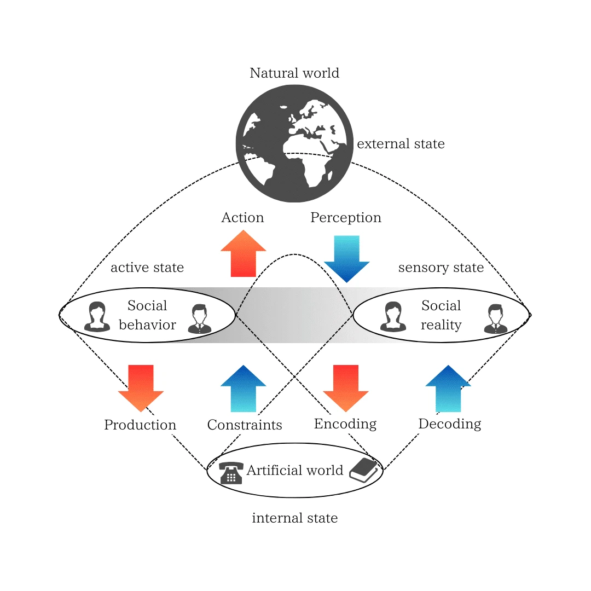
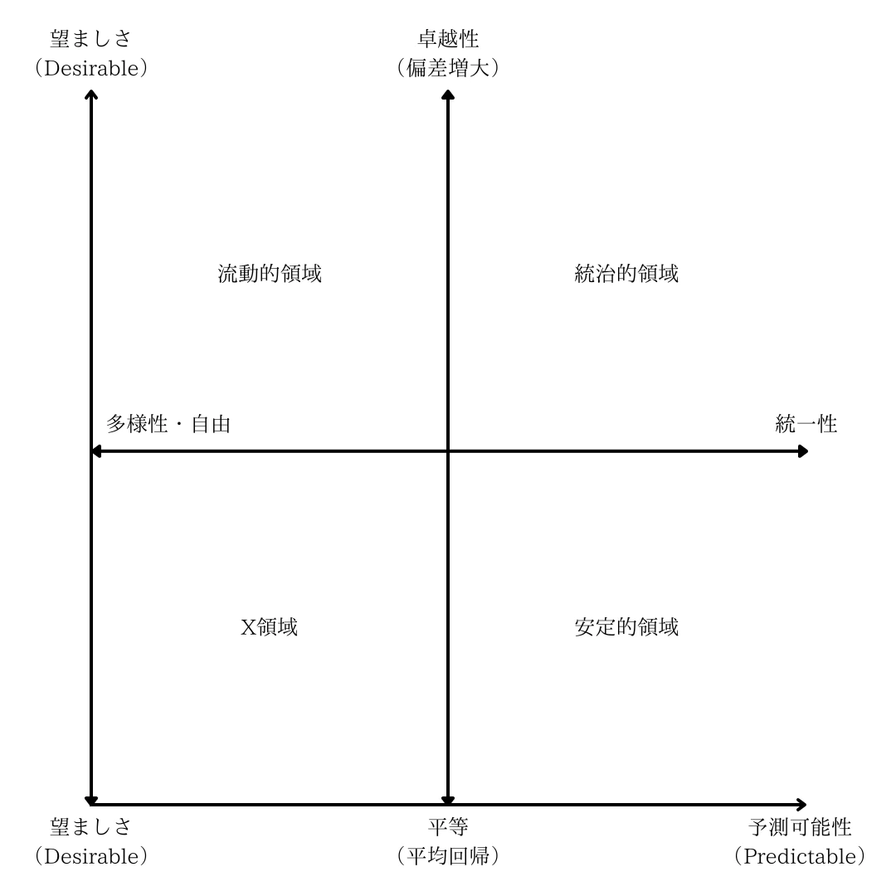
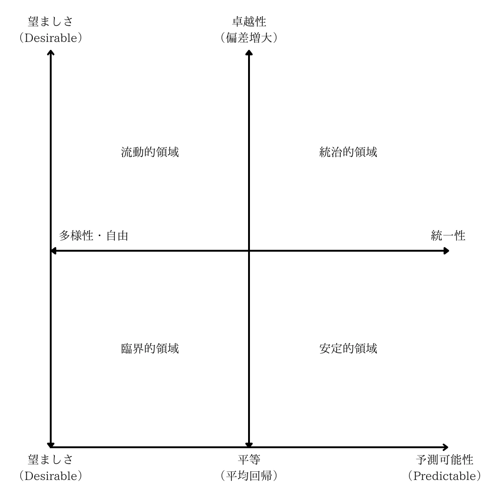
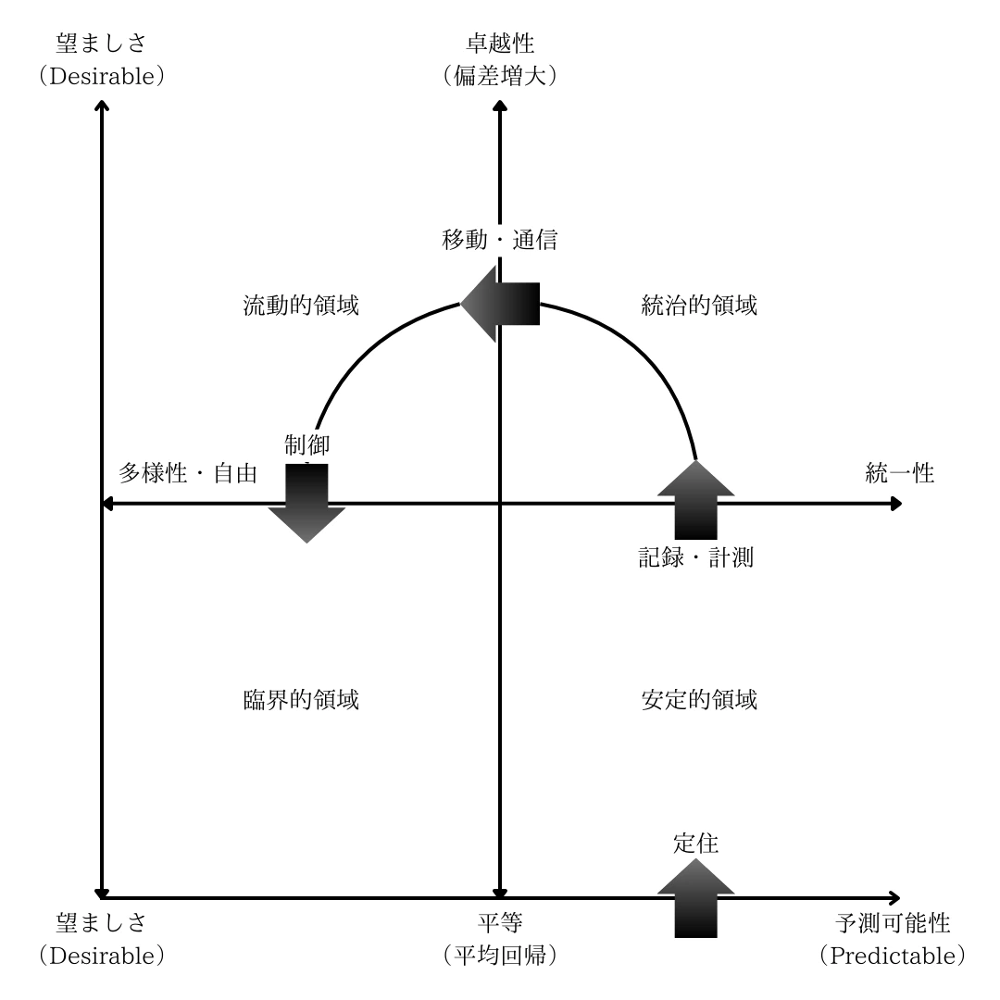
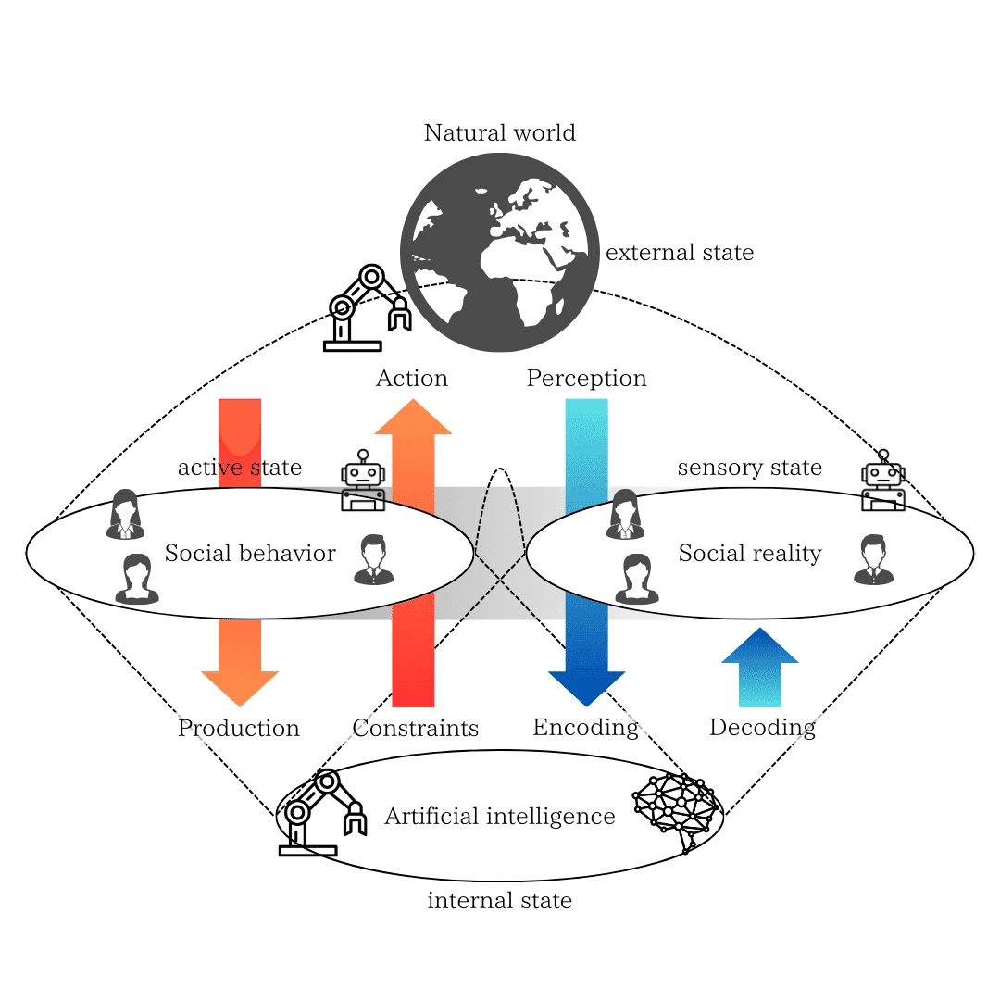

## 2章 唯物的価値構成

本章は、現代日本の思想家・批評家である柄谷行人が『力と交換様式』や『世界史の構造』で展開した「交換様式論」を重要な参照点とする。柄谷は、A: 互酬（共同体）、B: 略取と再分配（国家）、C: 商品交換（市場）、そしてD: Xから成る4つの交換様式という枠組みによって歴史的社会構造を分析した。

本試論では、これらの交換様式を唯物論的な存在原理の視点から捉え直す。すなわち、前章で「信念の力学」から着想した「真善美の普遍的形式」を柄谷の言う「力」とみなし、そこから導き出された「依存様式」を「交換様式」に対応する概念と解釈することで、『世界史の構造』を生命の存在原理から再構成する試みである。

### 2.1 情報理論的世界性

人間社会が自然環境とは際立って異なる「人工的」世界を構築する原動力は、世界の「物理法則」に求めることができる。特に、エネルギーや物質に関する「保存則」は、人間による「仕事」―すなわち「物」や「エネルギー」を特定の形態へと作り変える活動―が決して無価値ではないという原理的な動機を与える。なぜなら、物の保存則は、生命にとって「予期できる現実」の基礎となるからだ、そして、物を作り出す仕事は、その安定した基礎の上に「望ましい現実」を建設し積み重ねることで「調和的現実」を創出する、すなわち「善の追求」となり得るのである。

こうして創出された「物の世界」は、その内部に存在する生命にとって、自己の身体と物の諸関係性（物理法則に基づく）の中で適応的な価値観を育む環境となる。歴史を俯瞰すれば、まず物の世界そのものを変革する人々の「仕事」が先行し、その結果として変容した物理的・人工的環境が、後続の人々の生活様式や価値観に影響を与えてきた。これは、物の生産が人々の生活環境を規定し、価値観の変転を促すという、唯物論的な歴史観に通じる特質であり、その根底には物の保存則という条件が存在するのである。

> 仕事 work とは、人間存在の非自然性に対応する活動力である。人間存在は、種の永遠に続く生命循環に盲目的に付き従うところにはないし、人間が死すべき存在だという事実は、種の生命循環が永遠だということによって慰められるものでもない。仕事は、すべての自然環境と際立って異なる物の「人工的」世界を作り出す。その物の世界の境界線の内部で、それぞれ個々の生命は安住の地を見いだすのであるが、他方、この世界そのものはそれら個々の生命を超えて永続するようにできている。そこで、仕事の人間的条件は世界性である。
ハンナ・アレント『人間の条件』

この「物の世界」が価値形成に与える影響をより深く理解するために、視点を変え、「物の世界」を「情報の世界」として捉え直したい。これは、ハンナ・アレントが論じた「世界性」（仕事によって生成・維持され、世代を超えて持続する人間的な環境）の概念を、情報の保存、伝達、参照という観点から再解釈する試みである。アレントの「世界性」の核心は、人間が作り出した「物」が、自然の循環とは異なる時間スケールで持続し、個々の生命の誕生と死を超えて、後続世代の思考や行動、価値観を形成・変容させる力を持つという点にあった。すなわち、「仕事」を通じて環境に埋め込まれた何らかの構造物が世代を超えて引き継がれ、生命同士を結びつける安定した「公共領域」として機能するのである。

このアレント的な「世界性」を情報理論の枠組みで再定義すると、以下のようになるだろう。

情報理論的世界性（Informational Worldliness）：『生命（あるいは社会）が世代を超えて相互に利用・参照可能な、外部環境に確立された情報構造であり、個々の生命のライフスパンを超えて相対的に安定しているため、新来者を含む社会にとって、学習や協調のための「共通の外部参照フレーム」として機能するもの』

この定義に基づけば、「仕事」の成果物である「物」は、単なる物質ではなく、特定の情報を保持し未来へ伝達する媒体として機能する。これらは社会の「外部メモリ」あるいは「外部リソース」として作用し、個々の主体が世界を予測し行動する際の不確実性を低減させる一方で、思考や行動様式に制約を与える側面も持つ。

また、この情報構造は、記録媒体（物、書物、デジタルデータ等）を通じて長期間保持され、世代間やコミュニティ間での安定した情報共有を可能にし、社会的な秩序、知識、価値観の蓄積と変容を促進する。ここには、生命の内部状態（知識、信念）と外部世界の媒体に埋め込まれた情報との間に、ダイナミックな相互作用が存在する。生命は知恵や文化を外部世界に記録・符号化（Encoding）し、他の生命がそれを読み取り・解読して自らの内部モデルを更新（Decoding）する。この外部化と内部化の継続的な往復運動こそが、「世界性」を動的に維持・発展させるメカニズムである。

さらに重要なのは、この安定した情報理論的世界性を、能動的推論を行う多数の主体が共通の参照フレームとして利用し合うことで、言語や記号体系といった共有された意味の世界が創発・維持されると考えられる点である。近年、このプロセスを「集合的予測符号化(Collective Predictive Coding)」として捉える試みもあるように、社会そのものが、集合的な内部モデル（共有された知識、規範、価値観）を絶えず更新しながら環境に適応していく、一種の巨視的な能動的推論主体として理解する視座をもたらす。

すなわち、この情報理論的世界性という観点に立つとき、現に記号が記録され、処理され、参照される物理的な媒体や基盤（インフラストラクチャ）は、社会の「内部モデル」として捉えられる。すなわち、情報理論的世界性を生産し、記録し、参照する主体群を境界とし、それらが相互作用する自然環境とを区切る巨視的なマルコフブランケット構造（図3：Artificial Markov Blanket, AMB）こそが、私たちの社会の実像である。この人工的な情報処理構造の存在こそが、人間社会を自然の生態系から際立たせる根本的な特徴なのである。

||
|:--:|
|図3：Artificial Markov Blanket (AMB)|

図3は、人間社会と人工世界の全体を巨視的なマルコフブランケットと見なす概念図である。上部に描かれた「Natural world（自然世界）」は、社会が影響を受ける外部環境や物理法則の総体を表し、下部の「Artificial world（人工世界）」は、テクノロジーやメディアなど、人間が作り出した人工的な基盤を指している。そして中央のグレー帯において、「Social behavior（社会的行動）」と「Social reality（社会的現実）」を区別し、その両者が自然世界および人工世界と相互作用する境界条件として作用することで、社会全体としての能動的推論が実現するという構造を示している。

人工世界と社会的行動の間には「Production（生産）」「Constraints（制約）」という二方向の矢印が描かれている。これは、社会が新たな技術や媒体を「生産」する一方で、それらが人々の行動様式や価値観を「制約」し、既存の秩序（相互調和）を強化または変容させる両方向の力学関係を示す。

人工世界と社会的現実の間に描かれている「Encoding（符号化）」「Decoding（復号化）」という矢印は、人工世界における情報のやり取り（書物・データ・通信など）を通じて、社会的現実がどのように変容しうるかを表している。社会的現実の再定義や、新たな価値観の形成・拡散といった現象も、ここで説明可能となる。

一方、上部の「Action（行動）」と「Perception（知覚）」という赤青の矢印は、自然世界への働きかけとそのフィードバックを示している。社会的行動が自然環境に影響を及ぼすことで、そこからの知覚情報が社会的現実を通して人工世界で符号化され、社会的行動を再び更新する。このように、自然世界と社会の間にも双方向の循環構造があることがわかる。

総じて、この図が示唆するのは、「自然世界」「社会的行動・社会的現実」「人工世界」の三層が、それぞれに固有のフィードバック経路で結ばれながら、つねに社会を安定的に生成・維持・拡張していくというプロセスである。

本試論の提起として、この技術的・情報的な構造体（AMB）の確立と維持こそが、「統治（governance）」が成立するための主要な条件であると考える。すなわち、伝統的に統治の基盤と見なされてきた「社会契約」のような合意形成は、むしろこのAMBという技術的・情報的基盤が次第に確立される過程の下で、人々が適応し、相互作用する中で二次的に形成されるものと考えるのである。

## 2.2 自己言及性

> 人間社会の特徴は、創発的な現象を予見した行動の結果、形成された制度である。そのような再帰的な制度の創発は「2次の創発」（second-order emergence）と呼ばれており、人間社会を動物社会から区別する顕著な特徴のひとつであると言える。
ナイジェル・ギルバート『社会シミュレーションの技法』

前節で論じた、物理法則に根差し情報理論的に捉え直された「世界性」は、人間社会が自然環境から区別されるための、人工的かつ物理的な基盤を提供するものであった。本節では視点を転じ、この物理的・情報的基盤の上に展開される人間社会そのもの、とりわけその特質である自己言及性（Self-Referentiality）に焦点を当てる。 人間社会は、自らが引き起こす創発現象を予見し、それに対応する形で制度を形成するという再帰的なループ、すなわち「二次の創発」を特徴とする。この自己言及的な性質を深く理解するために、まずは経済学や社会学で用いられてきた「費用（cost）」や「機能（function）」といった概念を、本試論の文脈に沿って再定式化することから議論を始めたい。

まず、取引費用（Transaction Cost）の概念を導入する。ここでは、取引費用に2つの異なる位相（phase）を区別する。

第一の位相は、相互調和の生成過程において勘定される損失を指す。これは、物やエネルギーの変換・移動に伴う物理的な資源（物質、情報、空間、移動手段など）の消耗のみならず、機会損失、リスク増大、精神的負担といった無形の要素も含む。さらに、生命存在にとって究極的な状況、すなわち生存そのものが脅かされる際には、生命の可死性（mortality）そのものが最大の取引費用として組み込まれる。これらの損失は、生命の調和的現実を不安定化させ、あるいは崩壊させうる直接的な要因・リスクであり、原理的に「悪」として認識される。

第二の位相は、相互調和の反復過程において、特定の社会を維持するために勘定される損失である。この位相の損失は、主に共時的な視点、すなわち特定の時期における社会関係の構造やバランスを保つ観点から認識される点が特徴である。具体的には、第一の位相で挙げたような資源や機会の損失に加え、社会的に構築され制度化された依存様式（互酬、略取と再分配、商品交換など）を維持・遵守するための費用（例：贈答の負担、義務の履行、ルール遵守に伴う不自由など）や、逸脱に対する制裁のリスクなどが含まれる。これらの費用は、社会全体の崩壊という「悪」を回避し、安定した調和的現実を維持するための「善」、あるいは受け入れられるべき「必要悪」として、社会の人々によって（暗黙的あるいは明示的に）評価・正当化される。

次に、機能（Function）の概念を導入する。機能とは、ある事象（入力）が、特定の主体にとってどのような価値（出力）を生み出すか、という因果関係の認識に基づく概念である。主体がその出力結果を肯定的に評価し、「真善美」に類するものと見なす場合は順機能（Eufunction）、否定的に評価し、「偽悪醜」に類するものと見なす場合は逆機能（Dysfunction）と呼ばれる。また、その機能があらかじめ意図され、予期されていた場合は顕在的機能（Manifest Function）、意図せず予期せぬ形で現れる場合は潜在的機能（Latent Function）に分類される。

これら2つの概念を位置づけると、取引費用（特に第二の位相）は、社会における相互調和がどのような具体的な依存様式を通じて維持・再生産されているかを分析するための概念であると言える。例えば、取引費用概念を用いた比較制度分析は、異なる社会制度（市場、企業、国家、コミュニティなど）が、それぞれどのような取引費用を節約／発生させるか比較することで、その効率性や特性を論じる。

一方、機能は、相互調和に関与する主体が、どのような信念体系や価値観に基づいて事象を評価し、行動を選択しているかを分析するための概念である。例えば、ある制度や政策が持つ多様な機能（順／逆、顕在的／潜在的）を同定し、異なる手段で同じ順機能（価値）を実現できないか検討する等価機能分析（Functional Equivalence Analysis）などがこれにあたる。

費用と機能という概念が単なる理論的構成物ではなく、実社会における具体的な実践と結びついていることは、以下の例からも見て取れる。企業や国家の会計報告や組織図は、まさしく第二の位相の取引費用（貨幣や権限に関する費用）を把握し、最適化しようとする試みに他ならない。また、政策が立案・評価される際には、その政策が持つ多様な機能（期待される効果や潜在的なリスク）が定性的・定量的に推論され、判断材料とされるのが通例である。

前節で論じたように、世代を超えて安定的に情報を保存・伝達・参照可能な基盤、すなわち「情報理論的世界性」の確立は、統治が成立するための根源的な条件であった。この基盤をより具体的に捉えれば、それは社会の状態や活動を計測（measurement）し、それを記録（recording）する技術と実践に他ならない。文字、数字、地図、統計といった計測・記録システムは、社会の外部メモリとして機能し、複雑で広範囲にわたる社会現象を、時間と空間を超えて把握可能な情報へと変換する。

この計測と記録による情報基盤こそが、社会の自己言及性を高度に発達させる決定的な要因となった。社会は、自らが生み出した記録を通じて、自身の状態や変化を客観的に（あたかも「鏡写し」のように）観察し、分析することが可能になる。これにより、かつては不可能であったスケールの大きな統治的社会―例えば、広域国家における徴税、資源管理、法適用など―の運営が現実のものとなったのである。

そして、この計測・記録に基づいた自己言及的なプロセスは、人間の歴史における観念論的側面、すなわち価値観や思想が社会を動かす力を持つための重要な条件でもある。というのも、客観化された社会の認識を通じて、人々は「あるべき社会」の姿、つまり「理想」を構想し、抱くようになるからである。社会の記録が示すパターンや問題点への認識が、それを改善しようとする欲求や、新たな価値観の形成へとつながるのである。これこそが、マクロな情報構造がミクロな個人の価値観や思想に影響を与え、社会変革の駆動力ともなる「二次の創発」のメカニズムに他ならない。

本試論では、社会が追求しうる理想として、以下の4つを対置的に挙げる。
平等性: 個体間の偏差を縮小し、均質性や安定性を志向する理想。平均への回帰を望ましさとする美意識。
卓越性: 個体間の偏差を増大させ、特定の個体や性能の突出を志向する理想。偏差の増大を望ましさとする美意識。
統一性: 個人の行動や選択肢を制約することで、社会全体の秩序や予測可能性を高めようとする理想。
多様性・自由: 個人の行動や選択に対する制約を最小化し、自由な活動や差異の発現を促す理想。非拘束による自由。

これら4つの理想は、それぞれ独立に存在するのではなく、むしろ2つの対立軸を成すトレードオフ（trade-off）の関係にあると考える。すなわち、「平等性 vs 卓越性」という軸と、「統一性 vs 多様性・自由」という軸である。どちらの傾向をより重視するかは、状況や目的、あるいは主体の信念体系によって異なり、いずれも特定の文脈においては肯定され、理想とされうる。

この2つの対立軸を直交させてできる4つの象限は、それぞれ異なる様相の社会領域を表象していると考える。

||
|:--:|
|図4：4象限の社会領域|

安定的領域: 平等性と統一性が重視される領域。典型的には、人々の同質性と相互扶助に基づくコミュニティ、共同体、家族といった集団が存在する。
統治的領域: 卓越性（特定の権力や能力の突出）と統一性（規律やヒエラルキー）が重視される領域。現実社会では、国家や企業といった様々な規模の組織が成立している。
流動的領域: 卓越性（競争による勝者の選別）と多様性・自由（個人の自由な選択）が重視される領域。現実社会では、大規模な市場（Market）として成立している。
X領域: 平等性と多様性・自由が同時に追求される領域。この領域は従来の経済的・政治的支配構造から脱却し、多元的かつ自律的な連帯や協同、すなわちアソシエーションによる自由な結合に基づいて形成されるものである。そのため、具体的な社会的実態としては、協同組合、自発的な市民運動、地域通貨や贈与経済、オンラインのオープンソースコミュニティなどが挙げられる。

これらは、柄谷が『世界史の構造』や『力と交換様式』で提唱する交換様式との関連で論じられる四象限の枠組みと構造的に対応するものである。特に、平等性と多様性・自由が交差するX領域については、次節で詳しく論じることとしたい。

## 2.3 普遍的臨界性

まず、本節の議論の基礎となる方法論的視座について確認しておきたい。「構成論（Constructivism / Generative Approach）」とは、ある現象の背後にあると想定される基本原理に基づき、計算モデルを用いたシミュレーション（模擬実験）を行い、そこから現れる時空間パターンを観察することで、仮定した原理の妥当性を検証し、現象の生成メカニズムを理解しようとする方法論、あるいはそれによって得られる理論体系を指す。構成論的アプローチを通じて、私たちは複雑な世界の事象を、静的な構造としてだけでなく、動的な生成プロセスとしてより深く理解することが可能となる。

この構成論的な方法論を社会や歴史現象の解明に応用したのが、「人工社会研究（Artificial Society Studies）」あるいは「計算社会科学（Computational Social Science）」と呼ばれる学際領域である。これらのアプローチは、社会を構成する多数の主体（エージェント）が、それぞれ限定された情報と単純な規則に基づいて相互作用することで、いかにして複雑な社会秩序や予期せぬマクロ現象が「創発（emergence）」するのかを解明することを目指す。

構成論的視点に立てば、社会や歴史は固定された実体ではなく、多数の主体間の相互作用によって絶えず変動し、多様な経路へと分岐しうる動的なプロセスとして捉えられる。この動態を分析するために、計算モデルを用いたシミュレーションが強力なツールとなる。例えば、エージェント・ベース・モデリング（Agent-Based Modeling: ABM）は、個々の主体を自律的な「エージェント」としてモデル化し、それぞれに与えられた行動規則に基づいて相互作用させることで、社会全体のダイナミクスやパターンがどのように生成されるかを観察・分析する代表的な手法である。

ABMは現代の計算社会科学における主要な手法であるが、その根底にある、単純な要素間の局所的な相互作用からマクロな秩序や複雑性が創発するという思想は、セルオートマトン（Cellular Automaton）のような、より初期の計算モデルの研究にその源流を見出すことができる。セルオートマトンは、格子状の空間（セル）の状態が、隣接するセルの状態に基づいて一斉に変化する単純なモデルでありながら、驚くほど多様で複雑なパターンを生成する能力を持つ。こうしたモデルの研究は、スティーブン・ウルフラム（Stephen Wolfram）が提唱する計算等価性原理（Principle of Computational Equivalence）にもつながるように、自然界を含む世界の多くの現象が、根源において構成的（computational）であるという蓋然性を私たちに強く印象づけたのである。

ただし、初等的な計算モデルの多くは、全体の構成要素に均一かつ不変の規則を仮定し、同期的に更新を行う枠組みを扱ってきた。このような枠組みの下では、秩序とカオス、あるいは規則性とランダム性の間の絶妙な張り合い、いわゆる「カオスの縁（edge of chaos）」と呼ばれる臨界状態においてのみ、複雑で適応的な挙動が実現されると考えられてきた。しかし、この「カオスの縁」における臨界性は、規則やパラメータの変化に対して非常に敏感である。わずかな条件変化でシステムは秩序かカオスのいずれかへと容易に移行してしまうため、環境変動に晒されながら安定的に自己を維持する生命システム等の頑健な適応性を説明するには不十分であった。なぜそのような頑健なシステムが存在しうるのかは、依然として説明困難な課題（ハードプロブレム）とされてきた側面がある。

近年の研究、特にセルオートマトンを用いた研究は、この描像に大きな転換を迫っている。規則の適用を非同期的に行い、かつ「局所的な規則調整」のメカニズムを導入した「非同期調整型セルオートマトン（Asynchronously Tuned Elementary Cellular Automata: AT-ECA）」のようなモデルでは、元となる（同期的・均一な）規則がカオス的であろうと秩序的であろうと、システムは自律的に臨界的な振る舞いを示すようになる。これは、特定のパラメータ調整なしに臨界性が「普遍的に」現れることを意味し、「普遍的臨界性（universal criticality）」と呼ばれる。

この普遍的臨界性は、同期的で均一・不変な規則に基づく枠組みにおける「カオスの縁」という脆弱な描像を克服する可能性を秘めている。非同期性と局所的な規則調整の導入により、システムは外部環境の揺らぎや内部パラメータの変化に対して、頑健な適応性を自己組織的に獲得しうるのである。

ここからは類推（analogy）に基づく考察となるが、AT-ECAモデルに導入された「局所的な規則調整」のメカニズムは、前節までに論じてきた自由エネルギー原理（Free Energy Principle: FEP）におけるマルコフブランケットを介した内部状態（信念）の更新プロセスや、神経科学におけるヘッブの法則（Hebbian learning）に代表される、相互作用を通じてシナプス結合強度などが変化する学習・適応プロセスと、構造的に同型（isomorphic）であるように思われる。すなわち、相互作用の結果に応じて、相互作用の仕方（規則）自体が変化するというループ構造である。さらに言えば、局所的な調整を通じて外部との境界を維持するAT-ECAのようなシステムは、それ自体が一種の巨視的なマルコフブランケットを持つ構造と見なすことも可能である。

ただし、ここでの類推はあくまで理論的可能性を探るための直観的な示唆に過ぎない。これらの異なる理論領域（複雑系科学、情報理論、神経科学、統計物理学など）の間に厳密な架橋を行うためには、さらなる理論的・実証的な論証が不可欠であることは明確に断っておきたい。

しかし、この類推が一定の妥当性を持つと仮定するならば、興味深い示唆が得られる。すなわち、もしマルコフブランケット（内部と外部を区別し、相互作用を通じて自己維持する境界構造）を持つ「物」（原子、分子、細胞、個体、社会システムなど）が宇宙に普遍的に存在するならば、そしてそれらが非同期的に相互作用し、局所的な調整（学習・適応）を行うならば、私たちの宇宙は、特定の物理定数や初期条件に極度に依存することなく、普遍的に自己組織化臨界（universal self-organized criticality）の状態に向かう性質を持つのかもしれない。

もしそうであれば、生命や意識、社会といった複雑な構造がこの宇宙でどのように存在しうるのかという、様々な「存在問題（problem of existence）」に対する私たちの見方は、大きく変わるだろう。普遍的臨界性が自己組織化をよりありふれた普遍的な現象とするならば、これらの複雑な存在は、物理定数の奇跡的な微調整や、極めて稀な初期条件を前提とする奇跡の産物ではなくなり、その起源と維持の説明は、もはや原理的に解けない「ハードプロブレム」ではなくなるのかもしれない。

このような視座は、例えば、私たちが存在するために宇宙が人間にとって都合のよい特別な性質を持たなければならない、と結論づける「人間原理」や、社会の成立基盤として、理性を持つ合理的な個人の（暗黙的あるいは明示的な）合意を仮定する古典的な「社会契約説」といった、ある種の超越的な説明原理を導入するアプローチとは一線を画すものである。

すなわち、普遍的臨界性の概念は、第一に、私たちの宇宙における生命や社会を含む複雑な存在の起源と進化を、特別な仮定を置かない、より自然な物理的プロセスとして理解できる可能性を示唆する。第二に、個々の主体が必ずしも完全に合理的でなく、全体を見通せるわけでもなくとも、局所的な相互作用と調整を通じて、いかにして安定した社会秩序が形成され、維持されうるのかという、より現実的で実践的な社会形成論への理論的洞察を与える可能性を秘めているのである。

最後に、本節で展開した普遍的臨界性の議論を、前節で提示した社会の理想類型に関する四象限の枠組み（図4）へと接続しておきたい。前節では、特に「平等性」と「多様性・自由」という2つの価値軸が交差する左下の領域を「X領域」として保留した。本試論では、このX領域こそが、本節で論じた普遍的臨界性の概念によって特徴づけられる社会状態、すなわち自己組織的に秩序とカオスの境界を維持し、頑健な適応性を示す状態に対応する可能性を指摘したい。したがって、以降、このX領域を「臨界的領域（Critical Domain / Society）」と呼び、その性質や意義についてさらに考察を深めていくこととする。

なお、ここで言う「臨界的領域」は、あくまで普遍的臨界性が最も持続的かつ顕著なかたちで現れる舞台を指すのであって、臨界現象そのものが他の三領域には存在しない、という意味ではない。安定的・統治的・流動的各領域においても、局所的・一時的な臨界状態は十分に起こりうる。しかし、X領域では「平等性」と「多様性・自由」という張力の強い価値軸が恒常的に競合し、システムが自己組織的に秩序とカオスの境界へ引き寄せられ続けるため、臨界性が常態として現れやすい―この特徴ゆえに、本試論では X領域をとりわけ「臨界的領域」と名指しているのである。

||
|:--:|
|図5：4象限の社会領域（改訂）|

## 2.4 世界史の構成

前節までの議論で、私たちは社会を、自然世界と人工世界の間で情報をやり取りし、自己を維持・発展させる巨大な情報処理システム、すなわち人工的マルコフブランケット（AMB）として捉える視点を得た。また、社会が自らの状態を計測・記録し、それに基づいて理想（平等性・卓越性・統一性・多様性）を追求する自己言及的なプロセスを持つこと、そしてその動態が特定の条件下で普遍的臨界性を示し、適応的で頑健な「臨界的社会」へと至る可能性についても論じた。

本節では、これらの概念を統合し、人類史を貫く構造的な変化の駆動力、すなわち柄谷の『世界史の構造』を唯物論的な視点から捉え直すことを試みる。特に、技術的基盤（AMBの進化）と、それによって駆動される社会の主要な依存様式（交換様式）の変遷に着目する。

図5は、世界史における支配的な社会領域の変遷を模式的に示したものである。前節（図4）と同様に、社会領域を4つ（安定的、統治的、流動的、臨界的）に区分する。図5は、世界史における支配的な社会領域が、技術革新に伴いどのように変遷してきたかを模式的に示したものである。そして、技術革新が社会をどの領域へと移行させる傾向があったかを太い矢印で示している。

||
|:--:|
| 図6：世界史の構成|

まず柄谷が指摘するように、「定住」（農耕牧畜の開始）は人類社会を「安定的領域」へと導いた主要な技術的基盤であった。定住により食料生産が安定し、予測可能性が高まると、人々は土地に根差した共同体を形成し、互酬性（贈与と返礼）に基づく相互扶助の関係性を強化した。ここでは、集団内の「平等性」と「統一性」が重視される安定的社会が支配的となる。これは柄谷の言う交換様式A（互酬）が優位な社会に対応する。

次に、「記録・計測」技術（文字、度量衡、暦など）の発明は、社会を「統治的領域」へと押し上げる力となった。これらの技術は、広範囲の人間と資源を管理・動員することを可能にし、AMBとしての社会の情報処理能力を飛躍的に高めた。これにより、特定の権力者（王、神官など）による「卓越性」と、法や官僚制による「統一性」を特徴とする大規模な国家が形成される。そこでは、略取と再分配（あるいは庇護と服従）といった交換様式Bが支配的となる。計測と記録は、社会の自己言及性を高め、統治の基盤を確立したのである。

続いて、「移動・通信」技術（運航技術、印刷術、電信電話、そして現代のインターネット）の発達は、社会を「流動的領域」へと大きくシフトさせた。移動および情報通信費用の劇的な低下は、ほぼ熱力学的な無作為性（randomness）によって地理的制約を超えた広範なネットワークの形成・拡大をもたらし（図7）、人々の「多様性・自由」な活動（移動、交易、情報交換）を爆発的に増大させた。

||
|:--:|
|図7：移動・通信技術発展に伴うAMBの変化|

この図は、移動・通信技術の発展（①移動・通信コスト削減）が社会ネットワークの拡大（②）をもたらす一方で、異なるAMB間の相互作用と融合が加速し、新たな社会問題（③、例えばグローバルな格差や環境問題、パンデミックなど）を引き起こす可能性を示唆している。

この流動性の高まりの中で、貨幣を媒介とした商品交換（交換様式C）が社会の隅々まで浸透し、「卓越性」（競争による勝者）と「多様性・自由」（個人の選択）を最大化する市場メカニズムが支配的な力を持つようになった。

そして現代、私たちは「制御」技術、とりわけ人工知能（AI）という新たな技術的転換点を迎えている（図8）。

||
|:--:|
|図8：Artificial intelligence (AI)|

この図は、AIが社会のAMB構造自体に組み込まれた状況を示している。AIは、人工世界の「内部状態」（情報処理・知識生成）だけでなく、自然世界への「行動」や「知覚」（センサー、ロボット）にも影響を与え、生産様式や社会的意思決定、さらには人間の認識や価値観そのものを変容させる可能性を秘めている。

これらの高度な情報処理・制御技術は、社会を単なる効率化や管理強化の方向だけでなく、これまで両立困難とされてきた価値（例えば、平等性と多様性・自由）を同時に追求する「臨界的領域」（図4、図5の左下）へと向かわせる潜在的な力も秘めている。前節で論じた普遍的臨界性が示す自己組織化と適応を促すような形でAIやネットワーク技術を設計・運用できれば、トップダウンの統制（統一性）や激しい競争（卓越性）に過度に依存することなく、変化に対して頑健で、多様な構成員の自由な活動を許容しつつ、全体としての調和（平等性・持続可能性）を維持する社会、すなわち「臨界的社会」の実現可能性が開かれるのではないだろうか。

ここで、私たちは一つの根源的な問いに直面する。すなわち、AIを含む高度な制御技術が社会を普遍的臨界性の領域へと近づけるならば、それは単なる歴史の一段階にとどまらず、歴史のあり方そのものの質的な転換を意味するのではないか、という問いである。より大胆に言えば、それは、物質的・技術的基盤が社会構造を強く規定してきた「唯物論的な歴史」の終わりであり、人間の観念、すなわち価値や理想が社会をより直接的に形成していく「観念論的な歴史」の始まりを告げるものかもしれないのである。

なぜなら、臨界的領域において物質的希少性の軛が相対的に緩和され、価値創造の中心が知識や情報、創造性といった非物質的な領域へと移行するならば、社会の形態や方向性を決定するのは、もはや生産様式そのものというよりは、むしろ私たちがどのような「真善美」を志向し、どのような社会を「望ましい」と構想するかという、観念的な選択そのものになる可能性がある。社会の自己言及性が極度に高まり、自らの状態を認識し、理想（観念）に基づいて自らを再編していく能力を獲得するならば、歴史はあたかも観念の自己実現プロセスのような様相を帯びてくる。

この転換点において決定的に重要となるのは、私たちがどのような「観念」、すなわちどのような「真善美」の調和を選択し、それをいかにして社会的な現実として紡ぎ出していくか、という実践的な問いである。未来はあらかじめ定められたものではなく、私たちの価値選択と、それを支える物質的・技術的基盤との相互作用の中に、まさに今、生成されつつある。

こうして見れば、柄谷が提唱する交換様式A（互酬）・B（略取と再分配）・C（商品交換）・D（X）は、単なる観念論的な交換形態を指し示すものではなく、歴史的な技術基盤（情報処理技術や生産手段など）の発展に伴って、人々が互いに生き延び、社会を維持するために適応的に形成してきた「唯物論的な依存様式」であると捉えることができる。すなわち、誰もがそれぞれの時代における技術的条件や資源分配の制約の下で、自らの安全や繁栄を確保するために他者との関係を再編してきた。それが結果として、交換様式A～Dとして類型化されるような具体的な社会構造を形成してきたと考えられる。

この視点に立つと、A（互酬）・B（略取と再分配）・C（商品交換）といった形態は、人間同士がどのように資源を交換し、秩序を形成し、互いの行動を調整してきたかを示す「生存上の戦略」と見ることができる。そこでは、贈与や返礼、庇護と服従、商品交換を通じた流動化といったメカニズムが、あくまで物質的制約の中での適応策として機能し、その底流には社会を安定的に再生産しようとする自然的・技術的要請が働いている。

さらに、柄谷の言うD（X）に当たる段階に至っては、AIや高度な制御技術の登場が象徴するように、新たなレベルの「情報的・物質的基盤」の確立が、従来の支配関係や市場競争を相対化する可能性をもたらす。これは、社会が「理念的な共創関係」の段階へと移行することを意味するが、やはりその背景には、情報技術やネットワークによる効率的な協働・分散化の基盤が不可欠である。換言すれば、「自由と平等」を同時に志向しうる臨界的社会の胎動は、決して純粋に観念論的な理想だけから立ち現れるのではなく、極めて唯物論的な次元―技術的制約や情報的インフラの新たな展開―に裏打ちされているのである。

唯物論を軽んじ、観念論を中心に歴史を論じてきた哲学者たちは、私たちを常に捉えて離さない物質の影響力を見失い、古典的な社会契約説に代表されるような、現実の基盤から遊離した観念的な天蓋を想像しようとしてきたのだが、思考がいかに高く飛翔しようとも、私たちの営みがこの物質世界の重力から逃れたことは一度もないのだ。
